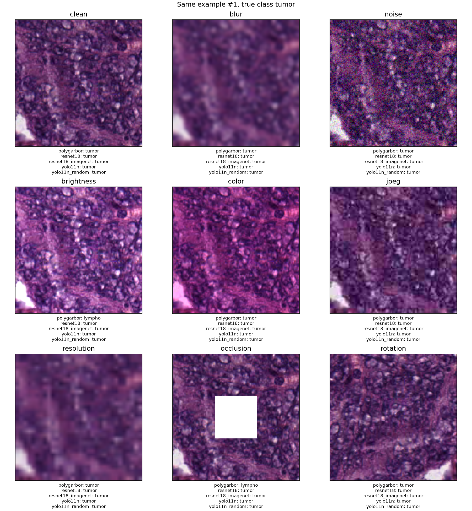
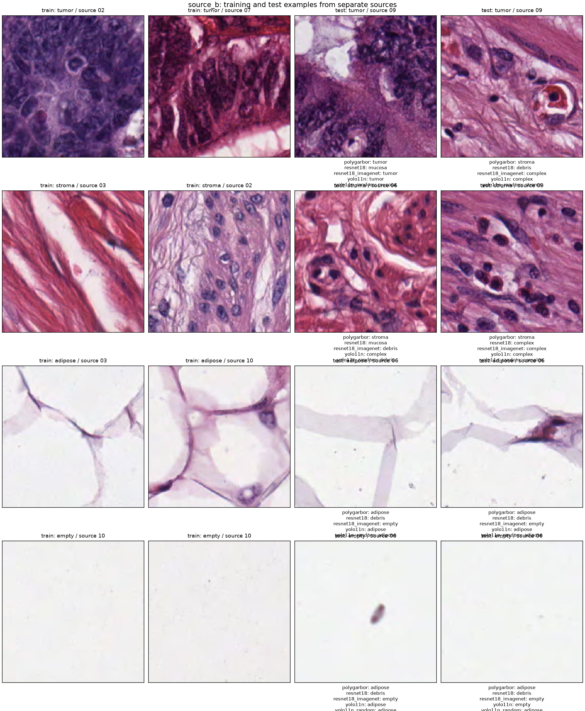
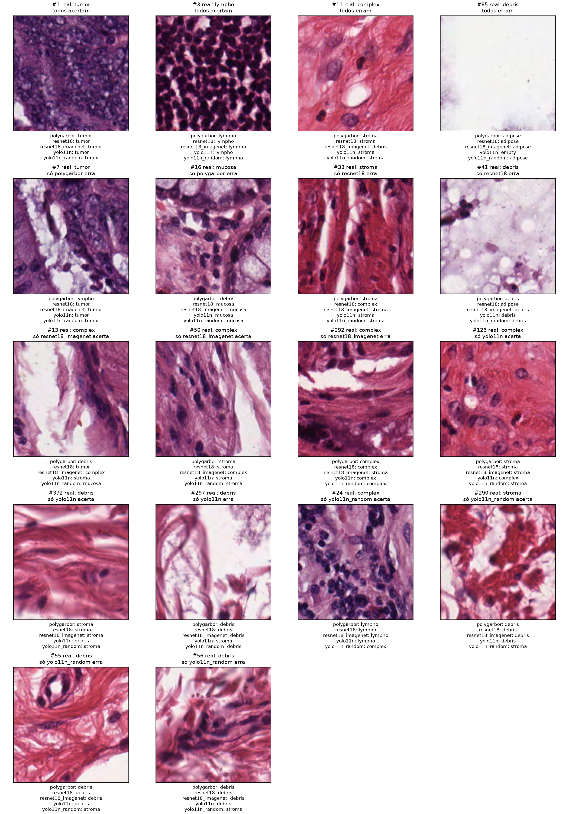

# Discussão dos resultados

Foram concluídos 138 treinamentos com avaliação, cobrindo sete pipelines, escassez de dados, desbalanceamento, ruído de rótulo e separação por origem. Os modelos completos foram avaliados também em oito perturbações de imagem. Foram executados 16 benchmarks de inferência em processos novos, cada um acompanhado de uma execução fria separada. Duas configurações adicionais falharam no ajuste: PolyGabor original com uma imagem por classe, nas duas seeds. Essas falhas estão preservadas e não foram transformadas artificialmente em métricas zero.

Os resultados favorecem a YOLO11n pré-treinada no equilíbrio entre classificação e latência; entre os três pipelines originais, o PolyGabor tem o menor modelo, menor consumo de RAM na inferência e treinamento mais barato. A ResNet do zero alcança bom resultado com o treino completo, mas foi muito instável com poucos exemplos e sensível à mudança de origem e cor. Essa conclusão descreve os pipelines executados: pré-treino externo, augmentations, otimizadores e orçamento efetivo de vetores diferem entre eles.

## Onde encontrar as evidências

O [relatório de tabelas](REPORT.md) apresenta os valores por seed; [metrics.csv](metrics.csv) contém todas as métricas; [run_index.csv](run_index.csv) identifica cada execução; [stage_resources.csv](stage_resources.csv) reúne tempos e recursos por etapa; [edge.csv](edge.csv) contém os benchmarks. O [protocolo](../../PROTOCOL.md), o [diário](../../WORK_LOG.md) e os manifestos [de imagens](../../dataset_manifest.json) e [de origens](../../source_manifest.json) registram preparação e decisões. Os caminhos `runs/...` do índice são relativos a `comparison/`.

Cada diretório em [runs/2026-09-12](../../runs/2026-09-12) conserva configuração, seleção de amostras, logs, tempos, recursos, modelo, predições individuais, métricas e figuras. As métricas principais usam as predições originais; calibração e comparação entre votação e ranking estão em arquivos separados.

## Desempenho com treino completo

Os valores abaixo são médias das seeds 42 e 43 no teste aleatório de 500 imagens. G-mean é calculado por execução e depois agregado; não é calculado a partir de recalls médios entre modelos.

| Pipeline | Macro-F1 médio | G-mean médio | Treinamento médio, s | Modelo de inferência, MB |
| --- | --- | --- | --- | --- |
| PolyGabor, 1 região | 0,7928 | 0,7774 | 20,57 | 0,651 |
| PolyGabor, 1 região + augmentation | 0,7791 | 0,7597 | 78,66 | 0,650 |
| PolyGabor, 9 regiões | 0,5225 | 0,4078 | 29,16 | 0,649 |
| PolyGabor, 9 regiões + augmentation | 0,5722 | 0,4804 | 98,59 | 0,649 |
| PolyGabor, 25 regiões | 0,4269 | 0,0000 | 36,65 | 0,648 |
| ResNet-18 do zero | 0,9078 | 0,9006 | 173,85 | 45,009 |
| YOLO11n pré-treinada | 0,9510 | 0,9504 | 269,81 | 3,204 |

Treinamento inclui construção, preparação da pipeline, extração de features quando aplicável e ajuste. MB usa 1.000.000 bytes. O modelo ResNet foi exportado sem o estado do Adam; os checkpoints antigos com otimizador foram preservados fora do diretório do modelo e a equivalência das probabilidades foi verificada. O tamanho do arquivo não representa a RAM necessária nem inclui bibliotecas e ambiente Python.

Na seed 42, macro-F1 de treino/validação/teste foi 0,8663/0,8262/0,7802 no PolyGabor, 0,9256/0,9218/0,9052 na ResNet e 0,9711/0,9563/0,9624 na YOLO. As avaliações de treino usam imagens originais, sem augmentation. O gap do PolyGabor indica perda para imagens não usadas no ajuste, mas a proximidade entre validação e teste aleatórios das CNNs não garante generalização para outra origem.

As comparações pareadas mostram vantagens consistentes das CNNs sobre o PolyGabor original nas duas seeds desse teste. Há bootstrap por recorte e por dez grupos de origem em [paired_tests.csv](paired_tests.csv); o agrupado é mais adequado para considerar dependência entre recortes. McNemar e ajuste de Holm permanecem exploratórios. Com somente duas seeds e dez origens, não há base para afirmar uma ordenação universal ou extrapolar para pacientes novos.

Os escores também diferem em interpretação: softmax nas CNNs e similaridade normalizada das distâncias no PolyGabor. Na seed 42, ECE original foi 0,2759 no PolyGabor, 0,0179 na ResNet e 0,0220 na YOLO. Uma temperatura ajustada exclusivamente na validação reduziu o ECE do PolyGabor para 0,0683, sem alterar as classes preditas. Isso melhora a correspondência agregada entre escore e acerto nesse teste, mas não transforma automaticamente similaridade em probabilidade clínica confiável. NLL, Brier, AUROC, top-2, MCC, kappa e recalls por classe permanecem disponíveis nas tabelas.

## Onde o PolyGabor foi melhor

Em desempenho preditivo agregado, o PolyGabor superou a ResNet do zero quando o treino era muito pequeno. Com 2 imagens por classe, macro-F1 foi 0,196–0,233 no PolyGabor e 0,028–0,116 na ResNet; com 10, 0,492–0,510 contra 0,058–0,275; com 20, 0,545–0,594 contra 0,200–0,219. A variante com augmentation ampliou essa vantagem em vários desses pontos. Com 50 imagens por classe a ResNet ficou extremamente dependente da seed, variando de 0,283 a 0,853, enquanto PolyGabor ficou em 0,668–0,678. A YOLO pré-treinada permaneceu superior aos dois nesses cenários, então esta vantagem é sobre a ResNet treinada do zero, não sobre todas as CNNs avaliadas.

No split source_a, PolyGabor alcançou macro-F1 0,7544 contra 0,5407 da ResNet. Sob a alteração fixa dos canais de cor, PolyGabor padrão teve 0,3275 contra 0,2682 da ResNet, e a variante com augmentation chegou a 0,3679. Esses casos não formam uma vantagem geral de robustez: nos demais testes principais a ResNet ou a YOLO normalmente ficaram acima.

No custo operacional, entre os três pipelines originais, PolyGabor produziu o menor modelo, cerca de 0,651 MB, treinou em aproximadamente 20,6 s e teve menor RAM e partida fria na inferência. Ele também oferece descritores, respostas de filtros e distâncias com uma ligação matemática direta à decisão. Isso facilita auditoria do cálculo, embora não garanta que o mapa corresponda melhor à anatomia.

A galeria contém casos individuais em que somente PolyGabor acerta, como debris 247 e stroma 249. Eles demonstram complementaridade de erro e podem motivar um ensemble futuro, mas não devem ser usados como evidência de superioridade agregada.

## Pouquíssimos exemplos e G-mean

Os subconjuntos são aninhados dentro de cada seed, com 1, 2, 5, 10, 20, 50 e 100 imagens originais por classe, além do treino completo. O eixo X indica a quantidade por classe; o total de treino é oito vezes esse valor. Augmentations e regiões não são contadas como novos exemplos independentes. A faixa é mínimo/máximo entre duas seeds, não intervalo de confiança. A validação conserva 500 imagens rotuladas: essa experiência mede escassez no treino, não um orçamento total de anotação de oito ou dezesseis imagens.

Com uma imagem por classe, a YOLO obteve macro-F1 de 0,527–0,551 e G-mean de 0,355–0,452. A ResNet ficou em 0,028–0,055 de macro-F1 e G-mean zero. PolyGabor original falhou porque a implementação polinomial não suporta esse ajuste com um único vetor por classe. Com augmentation, o PolyGabor conseguiu ajustar e alcançou macro-F1 de 0,314–0,428 e G-mean de 0,130–0,331. As novas vistas fornecem variação computacional da mesma imagem; não substituem diversidade biológica.

Com 10 imagens por classe, macro-F1 foi 0,492–0,510 no PolyGabor, 0,532–0,554 com augmentation, 0,058–0,275 na ResNet e 0,819–0,849 na YOLO. Com 100, os valores foram 0,707–0,711, 0,713–0,739, 0,856–0,880 e 0,914–0,916, respectivamente. A ResNet apresenta uma transição muito instável: com 50 por classe, macro-F1 variou de 0,283 a 0,853. Não convém resumir esse ponto apenas pela média.

G-mean explicita a falta de cobertura: a ResNet mantém G-mean zero até 20 imagens por classe nas duas seeds, embora seu macro-F1 seja positivo. PolyGabor com 25 regiões tem G-mean zero até no treino completo: recall de mucosa é zero na seed 42 e recall de complex é zero na seed 43. No desbalanceamento, 9 regiões com augmentation atingem macro-F1 0,5864, mas G-mean zero, outro exemplo de por que as duas métricas devem acompanhar os recalls individuais. A [explicação separada de G-mean e macro-F1](../../GMEAN_VS_MACRO_F1.md) detalha fórmula, interpretação, zeros e classes ausentes.

## Augmentation e downsampling espacial no PolyGabor

As variantes usam 1, 9 ou 25 regiões por imagem, correspondentes às grades 1×1, 3×3 e 5×5 do extrator existente. O banco de Gabor permanece igual; aumentar a grade não significa trocar o número de orientações/frequências do filtro. A augmentation adiciona três vistas determinísticas por original, com flips e brilho, somente no treino. A política aproxima a ResNet; não reproduz toda a política de classificação do Ultralytics.

O teto original de 350 vetores por classe foi mantido. Com 4.000 imagens, as grades produzem 4.000, 36.000 ou 100.000 vetores candidatos, mas só 2.800 entram no ajuste completo. Na seed 42, os vetores retidos representam 2.800 originais na configuração padrão, 2.170 com augmentation, 2.065 com 9 regiões, 2.048 com 25 e 2.040 com 9 regiões mais augmentation. Os números por classe estão em `effective_training.json`. Portanto, a comparação combina alteração da escala espacial com alteração da diversidade efetivamente retida; ela não isola somente o número de regiões.

Mais regiões pioraram fortemente o teste limpo. O treino também ficou baixo: macro-F1 de treino 0,5824 com 9 regiões e 0,4541 com 25, na seed 42. Isso aponta para dificuldades da representação/agregação nesse regime, e não apenas sobreajuste ao treino. Uma hipótese é que pequenas regiões de um recorte heterogêneo recebam um rótulo de imagem pouco representativo do conteúdo local, enquanto a votação perde contexto. A redução de originais retidos é outra explicação possível. Os experimentos não separam causalmente essas hipóteses.

Na figura de decisão de mucosa, exemplo 2, a grade de 9 regiões atribuiu cinco votos a tumor, três a mucosa e um a debris; a similaridade de tumor foi 0,328 e a de mucosa 0,320. Esse caso ilustra como regiões de uma mesma imagem podem discordar, mesmo com escores próximos.

Trocar retrospectivamente votação por ranking de similaridade não resolve consistentemente o problema: com 9 regiões, macro-F1 passa de 0,5379 para 0,5009 na seed 42 e de 0,5071 para 0,5161 na seed 43. A regra principal permaneceu votação em todas as tabelas e curvas. A análise está em [aggregation_comparison.csv](aggregation_comparison.csv), sem escolher a melhor regra pelo teste.

Augmentation não trouxe ganho consistente no teste limpo completo: melhorou na seed 42 e piorou na 43. Entretanto, ajudou com poucos dados, elevou o macro-F1 médio sob brilho de 0,3525 para 0,5021 e melhorou source_b de 0,5000 para 0,5692, passando G-mean de zero a 0,6112. O custo foi aproximadamente quatro vezes o tempo de extração no treino; a inferência continua usando uma única imagem, sem test-time augmentation.

## Robustez, desbalanceamento e rótulos incorretos

A [comparação de robustez](robustness.png) usa os mesmos pixels perturbados para todos os pipelines. YOLO teve melhor resultado na maioria das condições, mas a ResNet foi melhor sob desfoque, macro-F1 médio 0,7538 contra 0,6509, e ruído aditivo, 0,8985 contra 0,7791. Reduzir a imagem para 32×32 e reampliar prejudicou ambas, aproximadamente 0,6375 e 0,6353. A ResNet caiu para 0,2682 sob alteração dos canais de cor, enquanto YOLO manteve 0,9252. A inspeção da galeria confirma que essa perturbação altera a coloração aparente do tecido e que a redução de resolução remove detalhes; não representa uma medição de scanner real.

No PolyGabor, 9 regiões melhoraram a oclusão média de 0,3166 para 0,3919, apesar da grande piora no teste limpo. Isso sugere uma vantagem localizada quando parte da imagem é coberta, insuficiente para compensar a perda geral observada. Os testes têm uma severidade fixa por perturbação; não estimam limites de tolerância nem robustez a todas as combinações possíveis.

Quando tumor, stroma, complex e mucosa retêm apenas 10% das imagens de treino, o macro-F1 foi 0,4082 no PolyGabor, 0,5515 com augmentation, 0,7247 na ResNet e 0,9046 na YOLO. O teste foi mantido. Esse resultado evidencia a vantagem do pipeline pré-treinado nesse desbalanceamento específico, medido com uma seed.

Com 20% dos rótulos de treino trocados uniformemente para outra classe, macro-F1 foi 0,8248 no PolyGabor, 0,8831 na ResNet e 0,9369 na YOLO. A melhora inesperada do PolyGabor em relação ao treino limpo da seed 42 também aparece em grades maiores. Isso não demonstra que ruído seja desejável: a corrupção muda os grupos por classe, a seleção sob o teto de vetores e o ajuste das distâncias. Uma única realização de ruído não permite distinguir esses efeitos; rótulos corretos de validação e teste foram preservados.

## Generalização por origem e inspeção visual

Os splits aleatórios compartilham dez códigos de origem, recuperados por correspondência exata de SHA-256 dos pixels com os arquivos originais. Os testes adicionais separam esses códigos: source_a testa 09/10; source_b testa 06/09; ambos validam em 08. A publicação descreve dez lâminas, mas não foi confirmada uma identidade de paciente por código. Isso é separação por origem do arquivo, não validação clínica por paciente. [Dados originais](https://zenodo.org/records/53169), [artigo do dataset](https://pmc.ncbi.nlm.nih.gov/articles/PMC4910082/).

| Pipeline | Macro-F1 source_a | G-mean source_a | Macro-F1 source_b | G-mean source_b |
| --- | --- | --- | --- | --- |
| PolyGabor | 0,7544 | 0,7501 | 0,5000 | 0,0000 |
| PolyGabor + augmentation | 0,7330 | 0,7031 | 0,5692 | 0,6112 |
| ResNet-18 | 0,5407 | 0,4063 | 0,3444 | 0,0000 |
| YOLO11n | 0,8295 | 0,8102 | 0,8191 | 0,8282 |

Source_a tem 580 imagens de teste e source_b tem 1.403, com composições diferentes. Empty só aparece nas origens 06 e 10; não é possível colocá-la em treino, validação e teste com três conjuntos de origens disjuntos. A validação 08 não contém adipose e empty. Treino e teste contêm as oito classes, mas a seleção de checkpoint não recebe evidência de validação dessas duas classes. Essas restrições fazem parte do resultado e impedem atribuir toda a diferença à mudança de domínio.

Na galeria, adipose e empty compartilham grandes áreas claras, mas adipose apresenta estruturas e contornos mais visíveis. A ResNet de source_b classificou todos os 129 exemplos de adipose e todos os 590 de empty como debris. O PolyGabor original não acertou nenhum empty. A YOLO preservou recalls positivos nas oito classes, embora também apresente erros nos exemplos de fundo claro. A galeria é evidência qualitativa dessa dificuldade; não comprova que o modelo use exclusivamente cor, fundo ou qualquer estrutura histológica específica.

Os exemplos foram selecionados automaticamente pelos primeiros índices em categorias de concordância, incluindo todos acertam, todos erram e acertos/erros exclusivos. Há erros compartilhados em complex: no exemplo 11 os três predizem stroma, e no 13 as predições variam entre debris, tumor e stroma. Também há casos em que só o PolyGabor acerta, como debris 247 e stroma 249, e casos em que só a YOLO acerta, como stroma 0 e mucosa 2. Isso demonstra complementaridade em imagens específicas, sem medir o desempenho de um ensemble e sem estimar frequências a partir de uma galeria deliberadamente selecionada.

## Explicabilidade

O PolyGabor oferece filtros, energias, features e distâncias por classe com interpretação computacional mais direta: orientação, frequência e estatísticas locais podem ser inspecionadas. Os mapas observados destacam padrões de textura, mas mapas densos de similaridade usam janelas e escala diferentes da classificação global. Eles não devem ser lidos como segmentação de tecido nem como probabilidade clínica por pixel.

Na ResNet, a arquitetura com global average pooling permite um CAM da classe usando ativações finais e pesos da cabeça linear. A resolução nativa é apenas 4×4 nesta configuração de entrada. O exemplo de tumor mostra influência distribuída em regiões amplas, inclusive periféricas; a ampliação para sobreposição cria uma aparência suave, mas não acrescenta localização celular. Os arrays nativos ficam salvos com as imagens de explicação.

Na YOLO, a explicação usa oclusão em uma grade 5×5 e mede quanto o escore da classe cai quando uma região é substituída pela cor média. O sinal importa: valores negativos indicam aumento do escore após ocultar a região. No exemplo de tumor inspecionado, a maior queda foi aproximadamente 0,000031, apesar do contraste aparente do mapa; no exemplo de lympho foi zero. Em mucosa, a queda máxima chegou a cerca de 0,361. Saturação do softmax e a escolha da oclusão afetam a utilidade dessa explicação. As figuras agora mostram escala numérica, mínimo/máximo e cores divergentes quando há valores negativos.

As explicações dos três métodos foram inspecionadas visualmente. Além disso, PolyGabor e ResNet receberam uma avaliação quantitativa de localização em mosaicos sintéticos, descrita a seguir. Ainda não há contornos histopatológicos reais para medir fidelidade biológica dentro de tecido contínuo. Facilidade de interpretar a operação matemática não equivale a explicação histopatológica validada. Os tempos de explicação também não são uma comparação de trabalho idêntico: cada método produz tipos e quantidades diferentes de figuras.

## Localização quantitativa de tumor

Foram construídos 20 mosaicos de validação e 30 de teste, todos 4×4, com dois patches de tumor e quatorze das demais classes. Os 800 patches são únicos dentro de cada split e a posição dos dois positivos é aleatória e registrada. Na versão 1 posteriormente substituída, mapas calculados sobre o mosaico completo produziram AUROC em pixels 0,6408/0,6387 e Dice 0,2594/0,2588 no PolyGabor, contra AUROC 0,8964/0,8977 e Dice 0,5584/0,5889 na ResNet. Esses números permanecem aqui somente como registro da revisão e não são a conclusão atual.

Após a primeira inspeção visual, o protocolo foi corrigido porque calcular cada mapa no mosaico completo permitia que o campo receptivo e a interpolação atravessassem as bordas de imagens independentes. Na versão 2, cada patch é processado isoladamente na resolução normal do método e os mapas são remontados somente depois. A verdade é conhecida no nível de patch, portanto essa passou a ser a unidade primária; as métricas em pixels ficam como localização de região fracamente anotada, sem interpretação de segmentação interna.

Na explicação por patch, PolyGabor obteve AUROC 0,8274/0,8233, AP 0,3640/0,3543 e recuperou 46,7%/45,0% dos tumores entre os dois maiores focos. Os dois tumores apareceram simultaneamente no top-2 em 16,7% dos mosaicos nas duas seeds. A ResNet obteve AUROC 0,9703/0,9860, AP 0,7195/0,9158, recall top-2 78,3%/85,0% e ambos no top-2 em 56,7%/70,0%. As diferenças pareadas PolyGabor menos ResNet no AUROC por mosaico foram -0,131, IC95% -0,168 a -0,095, e -0,152, IC95% -0,196 a -0,111; no recall top-2 foram -0,317 e -0,400, com intervalos inteiramente negativos.

Separar a predição da explicação revelou outro resultado: o escore classificatório de tumor do PolyGabor teve AUROC 0,9638/0,9641 e recall top-2 de 80% nas duas seeds, muito acima do AUROC 0,8274/0,8233 e recall 46,7%/45,0% de seus mapas. A ResNet teve AUROC classificatório 0,9981/0,9984 e recall top-2 98,3% nas duas seeds. Assim, ambos perdem fidelidade ao converter a classificação em mapa espacial, mas a perda foi muito maior no PolyGabor.

Na figura revisada, verde marca cada patch tumor verdadeiro, amarelo tracejado marca os dois patches mais destacados pela explicação e ciano mostra o threshold escolhido na validação, com contornos calculados separadamente dentro de cada patch. Nos três exemplos fixos, a ResNet recuperou os dois tumores em todos; o PolyGabor recuperou zero, um e zero. Os mapas PolyGabor continuam formando regiões internas amplas, mas não existe mais vazamento computacional entre patches. O [relatório específico](localization/README.md) contém todas as métricas, thresholds e artefatos brutos.

O PolyGabor produziu os 800 mapas individuais e suas predições em cerca de 826,4/813,6 s por seed, sem VRAM. A ResNet processou os patches em lote na GPU em 5,3/2,1 s por seed. Esses tempos incluem tanto os mapas quanto os escores classificatórios isolados; refletem as implementações atuais e não uma equivalência de hardware entre CPU e GPU.

Os mosaicos fornecem rótulo exato para cada bloco porque cada imagem já possui uma classe, mas não fornecem máscara de tumor dentro desse bloco. O teste mede identificação e concentração de evidência entre imagens de uma colagem artificial, não contornos tumorais numa lâmina. O arquivo local contém os 5.000 patches e não o dataset separado `colorectal_histology_large`; por isso os mapas qualitativos nas dez imagens grandes mencionados na proposta ainda não foram executados.

## Tempo de cada etapa e recursos computacionais

Valores da seed 42 com treino completo; os tempos abaixo são etapas instrumentadas, em segundos, e não incluem todas as operações do processo. A avaliação CNN usa GPU neste quadro; PolyGabor usa CPU. Consultar [stage_resources.csv](stage_resources.csv) para todas as execuções e etapas, inclusive preparação das perturbações, aquecimento e salvamento.

| Pipeline | Extração de features | Ajuste | Avaliar 4.000 imagens de treino | Avaliar 500 de teste limpo | Gerar explicações |
| --- | --- | --- | --- | --- | --- |
| PolyGabor | 20,72 | 0,47 | 89,14 | 10,94 | 24,04 |
| PolyGabor + augmentation | 86,88 | 0,41 | 91,43 | 11,42 | 25,60 |
| PolyGabor, 9 regiões | 29,17 | 0,57 | 167,16 | 19,10 | 27,23 |
| PolyGabor, 25 regiões | 39,41 | 0,76 | 195,42 | 22,82 | 30,76 |
| ResNet-18 | Integrada ao ajuste | 141,38 | 4,71 | 0,39 | 3,40 |
| YOLO11n | Integrada ao ajuste | 290,11 | 1,99 | 0,22 | 2,54 |

O ajuste polinomial isolado é muito barato, mas a extração e as avaliações repetidas dominam o custo. Por isso, não se deve chamar os 0,47 s de tempo total de treinamento do PolyGabor. Na ResNet, construção e preparação somaram aproximadamente 4,53 s antes do ajuste; na YOLO, 17,62 s, incluindo preparação do dataset em disco. A ResNet treinou 26/40 épocas e a YOLO 28/21, com checkpoint escolhido por validação. Os históricos registram tempos por época; a curva da ResNet seed 42 mostrou validação oscilante no início e melhor acurácia em torno da época 18.

O equipamento foi Intel Core Ultra 9 185H, cerca de 32 GB de RAM e RTX 4070 Laptop de 8 GB. Durante o treino completo, PolyGabor usou em média cerca de um núcleo considerando extração e ajuste; o ajuste curto utilizou aproximadamente três a quatro núcleos. ResNet ficou perto de 60% de um núcleo de CPU e 87% de utilização global de GPU; YOLO perto de 3,4–3,5 núcleos de CPU e 40–46% de GPU global. O desktop também usa a GPU: essa porcentagem não é atribuível exclusivamente ao processo, e valores de GPU global durante PolyGabor não significam que o método use CUDA.

Os picos do processo completo foram aproximadamente 1,22–1,24 GB de RAM para PolyGabor original, 3,83–3,86 GB para ResNet e 3,47–3,49 GB para YOLO. A VRAM por PID foi zero, cerca de 2,98 GB e 0,71–0,80 GB, respectivamente. Esses picos incluem dataset, avaliação e figuras; não descrevem a memória mínima de inferência. A amostragem de 200 ms pode perder picos muito curtos. Não foram medidos energia em joules, consumo de bateria ou desempenho sob aquecimento prolongado.

## Inferência em condições de edge computing

O experimento restringiu afinidade a um processador lógico e bibliotecas a uma thread em `cpu1`; `cpu4` usou quatro threads; `gpu` usou a RTX local. Todos os processos foram novos, com imagens já carregadas em RAM. Latência inclui pré-processamento e execução sincronizada, excluindo leitura do arquivo de imagem e visualização. A medição fria separada inclui inicialização do processo, imports, carga, primeira predição e encerramento; o cache de arquivos do sistema operacional não foi esvaziado.

| Modelo, seed 42 | CPU1 mediana / p95, ms | CPU4 mediana, ms | RAM pico CPU1, MB | Partida fria CPU1, s | Modelo, MB |
| --- | --- | --- | --- | --- | --- |
| PolyGabor | 19,03 / 25,69 | 19,48 | 280,14 | 1,38 | 0,651 |
| PolyGabor + augmentation | 17,55 / 18,13 | 18,10 | 266,35 | 1,26 | 0,651 |
| PolyGabor, 9 regiões | 27,56 / 30,76 | 31,13 | 318,11 | 1,50 | 0,649 |
| PolyGabor, 25 regiões | 34,12 / 36,56 | 42,99 | 301,54 | 1,49 | 0,648 |
| ResNet-18 | 20,19 / 21,97 | 8,20 | 939,35 | 3,64 | 45,009 |
| YOLO11n | 3,32 / 3,76 | 2,88 | 825,00 | 3,22 | 3,204 |

A YOLO foi a melhor opção medida para latência com uma thread, aproximadamente 5,7 vezes mais rápida que PolyGabor original, além do maior macro-F1. PolyGabor teve vantagem de RAM, armazenamento e partida fria. A ResNet se beneficiou mais de quatro threads. Aumentar threads não ajudou PolyGabor e piorou várias grades; a implementação por imagem e custos de paralelismo limitam os ganhos. Esses valores vêm de uma execução por modo, com 100 latências após aquecimento, e não permitem interpretar diferenças pequenas como permanentes.

Com batch de até 32 em CPU4, throughput foi aproximadamente 50,5 imagens/s no PolyGabor, 263 na ResNet e 814 na YOLO. Na GPU, ambas as CNNs ficaram perto de 2,48 ms em batch 1, mas throughput foi cerca de 277 imagens/s na ResNet e 1.638 na YOLO. A VRAM da ResNet chegou a 4,32 GB nesse processo de inferência, influenciada pelo backend e buffers de batch; não deve ser estimada somente pelos 45 MB dos pesos.

Esta é uma aproximação de restrição computacional em x86, sem limite artificial de RAM, sem ARM e sem dispositivo Raspberry Pi/Jetson. Um modelo de 0,65 MB ainda precisou de centenas de MB com esta stack Python; não foi demonstrada execução em microcontrolador. Não foi executado treinamento sob restrição edge. O treinamento CPU medido do PolyGabor sugere menor custo para futuras experiências de adaptação local, mas memória, energia e desempenho no hardware alvo precisam ser medidos antes de uma conclusão de implantação.

## Usabilidade e equivalência dos programas

O projeto [cnn](../../../cnn/README.md) oferece `dataset`, `train`, `evaluate`, `predict` e `info`, com estrutura equivalente ao PolyGabor. Carregamento TFDS, ordem de classes e fluxos básicos são compartilhados. A ResNet preserva arquitetura, tamanho de entrada, política de augmentation e callbacks do notebook. A YOLO preserva seu backend e pré-treino. Os parâmetros específicos ficam explícitos, e opções de aprendizado/augmentation da ResNet não são silenciosamente aplicadas à YOLO.

PolyGabor tem instalação e ajuste menos dependentes de infraestrutura GPU, além de artefato pequeno e features explícitas. As CNNs exigem bibliotecas maiores; a preparação fixou versões compatíveis de TensorFlow, PyTorch e CUDA no ambiente isolado. A YOLO precisa dos pesos pré-treinados no primeiro uso. Depois de instalado e salvo o modelo, os mesmos comandos de carregar, predizer, avaliar e inspecionar foram verificados em CPU. A avaliação de usabilidade é uma inspeção do fluxo e desses testes, sem estudo com usuários.

## Integridade, recuperação e limites da comparação

A mudança de pasta interrompeu duas execuções YOLO: label_noise e source_b, seed 42. Os diretórios interrompidos foram arquivados em [runs/interrupted](../../runs/interrupted), com motivo registrado, e as configurações foram executadas novamente no caminho atual. As 56 execuções completas anteriores foram auditadas antes da retomada; ao final, as 138 completas passaram na auditoria de rótulos, ordem, probabilidades, métricas e artefatos. Não há treinamento pendente nesta campanha.

Os 16 benchmarks quentes e 16 subprocessos frios terminaram com código zero; em todos, as classes preditas coincidiram com as predições originais nas 100 imagens verificadas. Os 20 testes passaram. A [síntese de validação](validation_summary.json) registra esses resultados. Os logs da CLI estão em [cli_smoke](cli_smoke). A revisão final também corrigiu a sinalização do executor para que uma futura falha de benchmark ou teste impeça a publicação silenciosa de sucesso. Modelos, dados e checkpoints grandes estão preservados no disco e ignorados pelo Git; os resultados desta máquina dependem desses artefatos para reprodução imediata da inferência.

Os principais limites são duas seeds, perturbações de severidade única, poucos grupos de origem, validação grande nos cenários de treino pequeno, ausência de duas classes na validação por origem, pré-treino externo somente na YOLO e teto de vetores que muda a diversidade efetiva do PolyGabor. Os testes classificam recortes de tecido em oito classes; não demonstram diagnóstico de câncer por paciente nem desempenho em base clínica externa.

Como próximos experimentos, os resultados justificam separar o efeito de regiões do teto de vetores, testar amostragem que preserve número igual de originais, avaliar uma CNN pré-treinada com augmentation controlada para isolar o ganho de transferência, restringir também a validação no orçamento de poucos rótulos e repetir a inferência no hardware edge pretendido. Essas propostas não foram contadas como execuções realizadas nesta campanha.
