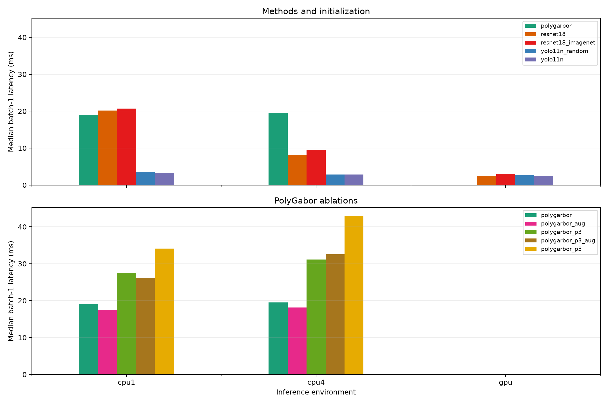

# Discussão dos resultados

Foram concluídos 178 treinamentos com avaliação, cobrindo nove pipelines, sete tamanhos de treino reduzido, treino completo, desbalanceamento, ruído de rótulo e dois splits por origem. Os modelos completos receberam ainda oito perturbações de teste. A campanha inclui controles pareados de inicialização: ResNet-18 aleatória versus ImageNet e YOLO11n aleatória versus ImageNet. Foram executados 22 benchmarks de inferência aquecida e 22 processos frios.

A melhor média no teste limpo foi da ResNet-18 ImageNet, macro-F1 0,9561, seguida da YOLO11n ImageNet, 0,9510. A YOLO ImageNet apresentou o melhor equilíbrio prático entre classificação, tamanho e latência: 3,204 MB e 3,32 ms em CPU com uma thread. O PolyGabor manteve as vantagens de pacote pequeno, 0,651 MB, menor RAM de inferência, partida mais rápida e operação matemática mais auditável, mas ficou abaixo das CNNs pré-treinadas na classificação agregada e na localização de tumor.

## Onde encontrar as evidências

O [relatório gerado](REPORT.md) contém todas as tabelas por seed. [metrics.csv](metrics.csv) reúne as métricas de treino, validação, teste e perturbações; [initialization_comparison.csv](initialization_comparison.csv) compara as configurações aleatória e ImageNet; [run_index.csv](run_index.csv) aponta para cada execução; [stage_resources.csv](stage_resources.csv) reúne tempos e recursos por etapa; [edge.csv](edge.csv) contém inferência; e o [relatório de localização](localization/README.md) detalha os mosaicos. O [protocolo](../../PROTOCOL.md), o [diário](../../WORK_LOG.md) e os manifestos [de imagens](../../dataset_manifest.json) e [de origens](../../source_manifest.json) registram decisões e preparação.

Cada diretório em `comparison/runs/2026-09-12` conserva configuração, seleção de amostras, log, tempos, recursos, modelo, predições individuais, métricas e figuras. Pilotos foram mantidos em campanha separada e não entram nestas tabelas. Modelos e dados grandes estão preservados localmente e ignorados pelo Git.

## Desempenho com treino completo

Os valores são médias das seeds 42 e 43 no teste aleatório de 500 imagens. G-mean é calculado em cada execução e depois agregado.

| Pipeline | Macro-F1 | G-mean | Treino, s | Modelo, MB |
| --- | --- | --- | --- | --- |
| PolyGabor, 1 região | 0,7928 | 0,7774 | 20,57 | 0,651 |
| PolyGabor, 1 região + augmentation | 0,7791 | 0,7597 | 78,66 | 0,650 |
| PolyGabor, 9 regiões | 0,5225 | 0,4078 | 29,16 | 0,649 |
| PolyGabor, 9 regiões + augmentation | 0,5722 | 0,4804 | 98,59 | 0,649 |
| PolyGabor, 25 regiões | 0,4269 | 0,0000 | 36,65 | 0,648 |
| ResNet-18 aleatória | 0,9078 | 0,9006 | 173,85 | 45,009 |
| ResNet-18 ImageNet | 0,9561 | 0,9556 | 174,76 | 45,012 |
| YOLO11n aleatória | 0,8618 | 0,8532 | 266,89 | 3,204 |
| YOLO11n ImageNet | 0,9510 | 0,9504 | 269,81 | 3,204 |

MB usa 1.000.000 bytes. Treino soma construção, preparação, extração quando aplicável e ajuste. O tamanho do artefato não inclui bibliotecas nem representa a RAM de execução. A diferença de tamanho entre inicializações da mesma arquitetura é desprezível, como esperado: os pesos iniciais alteram valores, sem alterar o número de parâmetros.

A ResNet ImageNet teve a maior média limpa, mas variou de 0,9419 a 0,9703 entre duas seeds. A YOLO ImageNet variou de 0,9396 a 0,9624. Com somente duas seeds e dez origens recuperadas dos nomes, essa diferença média de 0,0051 entre as duas não sustenta uma ordenação universal. As comparações pareadas por imagem e por origem estão em [paired_tests.csv](paired_tests.csv).

A calibração usa temperatura escolhida somente na validação e não altera a classe prevista. O ECE médio original foi 0,2859 no PolyGabor, 0,0269 na ResNet aleatória, 0,0153 na ResNet ImageNet, 0,0436 na YOLO aleatória e 0,0191 na YOLO ImageNet. Similaridade PolyGabor é um escore heurístico; não deve ser interpretada como probabilidade clínica mesmo após calibração.

## Efeito dos pesos ImageNet

O contraste dentro de cada família mostra uma grande vantagem associada à configuração ImageNet em baixa disponibilidade de dados. Na ResNet, essa configuração combina pesos ImageNet e a normalização de entrada correspondente, enquanto a original usa escala 0–1; o experimento não atribui causalmente o ganho somente aos pesos. O macro-F1 médio subiu de 0,0414 para 0,2842 com uma imagem por classe, de 0,1667 para 0,5537 com dez, de 0,5679 para 0,8973 com cinquenta e de 0,9078 para 0,9561 no treino completo. Com cem imagens por classe, a média mudou somente de 0,8684 para 0,8711 e as faixas entre seeds se sobrepõem bastante.

Na YOLO, ImageNet elevou o macro-F1 médio de 0,0290 para 0,5392 com uma imagem por classe, de 0,2778 para 0,8342 com dez e de 0,8618 para 0,9510 no treino completo. O ganho permaneceu positivo em todos os cenários agregados medidos para essa família. Sob desbalanceamento, a YOLO aleatória teve macro-F1 0,7124 e G-mean zero porque perdeu completamente ao menos uma classe; a pré-treinada atingiu 0,9046 e G-mean 0,8987.

O pré-treinamento não melhorou tudo. Em source_a, a ResNet ImageNet caiu de macro-F1 0,5407 para 0,4841 e de G-mean 0,4063 para zero; em source_b subiu de 0,3444 para 0,6084. Com 20 imagens por classe, a ResNet ImageNet variou de 0,2768 a 0,8519 entre seeds. Transferência ajudou muito em média, mas continuou sensível ao subconjunto e à mudança de origem.

## Onde o PolyGabor foi melhor

O PolyGabor foi competitivo quando o comparador também começou do zero. Com duas imagens por classe, o PolyGabor com augmentation alcançou macro-F1 médio 0,4162, contra 0,0721 na ResNet aleatória, 0,0290 na YOLO aleatória e 0,3517 na ResNet ImageNet. Com uma imagem por classe, essa variante atingiu 0,3709, acima de ambas as CNNs aleatórias e da média 0,2842 da ResNet ImageNet; a YOLO ImageNet ainda foi superior, com 0,5392.

Com dez imagens por classe, PolyGabor com augmentation obteve 0,5429, praticamente igual à média 0,5537 da ResNet ImageNet e acima das duas CNNs aleatórias. Com vinte, atingiu 0,6213, acima da ResNet ImageNet média de 0,5644, embora a grande faixa desta última impeça uma conclusão forte. A YOLO ImageNet permaneceu acima em todos esses pontos.

No split source_a, PolyGabor obteve macro-F1 0,7544, superando as duas ResNets, 0,5407 aleatória e 0,4841 ImageNet, e a YOLO aleatória, 0,5637. A YOLO ImageNet alcançou 0,8295. A vantagem mais clara e constante do PolyGabor foi operacional: menor modelo, menor RAM em inferência, partida fria mais curta e treino viável apenas com CPU.

A galeria de erros contém casos em que somente um método acerta. Ela foi refeita com os cinco pipelines principais e mostra complementaridade, sem usar exemplos escolhidos manualmente para alegar superioridade agregada.

## Pouquíssimos exemplos e G-mean

Os gráficos foram divididos em três painéis: métodos originais, controle de inicialização das CNNs e ablações PolyGabor. Isso reduz sobreposição de nove curvas. Os subconjuntos são aninhados dentro de cada seed, e o eixo X conta imagens originais por classe. Augmentations e regiões não inflam esse orçamento. A faixa mostra mínimo e máximo de duas seeds; não é intervalo de confiança. A validação mantém 500 rótulos, então o experimento reduz somente o treino.

O PolyGabor original falhou com uma imagem por classe nas duas seeds porque o ajuste polinomial não suporta um único vetor por classe. As variantes com augmentation ou múltiplas regiões ajustaram por gerar mais vetores computacionais, mas continuam partindo de uma única imagem biológica. Essas falhas estão preservadas e não foram convertidas em F1 zero.

G-mean tornou visíveis colapsos de classe escondidos por macro-F1. A ResNet aleatória teve G-mean zero até vinte imagens por classe. A ResNet ImageNet também teve G-mean zero com uma e duas, apesar do macro-F1 positivo. PolyGabor com 25 regiões teve G-mean zero até no treino completo. A [explicação de G-mean versus macro-F1](../../GMEAN_VS_MACRO_F1.md) detalha a diferença: macro-F1 média precisão e recall por classe, enquanto G-mean zera quando qualquer recall é zero.

## Augmentation e downsampling espacial no PolyGabor

As variantes usam grades 1×1, 3×3 e 5×5, correspondentes a 1, 9 e 25 regiões por imagem. O banco continua com oito pares de kernels Gabor. Augmentation adiciona original, flips horizontal e vertical e brilho ±0,1 somente no treino.

O teto de 350 vetores por classe foi preservado. Com o treino completo, as grades geram até 4.000, 36.000 ou 100.000 candidatos, mas somente 2.800 entram no ajuste. Na seed 42, eles representam 2.800 imagens originais no padrão, 2.170 com augmentation, 2.065 com nove regiões, 2.048 com 25 e 2.040 com nove regiões mais augmentation. Assim, a ablação altera escala espacial e diversidade de originais retidos ao mesmo tempo.

Mais regiões pioraram o teste limpo: macro-F1 médio 0,7928 com uma região, 0,5225 com nove e 0,4269 com 25. O macro-F1 de treino também ficou baixo, indicando dificuldade de representação/agregação além de sobreajuste. Uma causa plausível é que uma região pequena herda o rótulo global da imagem mesmo quando seu conteúdo local não representa a classe; outra é a perda de diversidade de originais causada pelo teto fixo.

Augmentation ajudou em vários pontos de poucos dados, mas não no treino completo: o macro-F1 médio completo caiu de 0,7928 para 0,7791. O custo de treino subiu de 20,57 para 78,66 s. Na inferência usa-se apenas a imagem original, portanto tamanho e latência permaneceram próximos. A comparação de votação com ranking de similaridade está em [aggregation_comparison.csv](aggregation_comparison.csv); trocar retrospectivamente a regra não corrigiu de modo consistente as grades maiores.

## Robustez e cenários adversos

A ResNet ImageNet teve macro-F1 médio 0,9421 sob ruído, 0,9138 sob JPEG e 0,9312 sob rotação, mas caiu para 0,6110 sob blur, 0,5999 sob alteração de cor e 0,5958 sob redução de resolução. A ResNet aleatória foi melhor que a pré-treinada em blur, 0,7538, e oclusão, 0,8897.

A YOLO ImageNet foi forte em cor, 0,9252, oclusão, 0,9263, e rotação, 0,9401. A YOLO aleatória apresentou duas vantagens inesperadas sobre a pré-treinada: blur 0,8503 contra 0,6509 e baixa resolução 0,8370 contra 0,6353. Isso não compensa sua perda limpa, mas mostra que pré-treinamento e robustez dependem da transformação.

No desbalanceamento fixado, macro-F1 foi 0,4082 no PolyGabor, 0,5515 no PolyGabor com augmentation, 0,7247 na ResNet aleatória, 0,9044 na ResNet ImageNet, 0,7124 na YOLO aleatória e 0,9046 na YOLO ImageNet. Com 20% dos rótulos de treino corrompidos, os valores foram 0,8248, 0,8831, 0,8881, 0,8581 e 0,9369 para PolyGabor, ResNet aleatória, ResNet ImageNet, YOLO aleatória e YOLO ImageNet, respectivamente. Esses cenários adversos têm apenas seed 42 e uma severidade; servem como sondas, não estimativas populacionais.

## Generalização por origem

Os códigos das dez origens foram recuperados dos nomes dos arquivos por SHA-256 dos pixels. Source_a testa origens 09/10; source_b testa 06/09; ambos validam em 08. O artigo descreve dez lâminas, mas identidade clínica de paciente não foi confirmada. Empty existe somente nas origens 06 e 10, e a validação 08 não contém adipose/empty; isso limita a seleção de checkpoint.

| Pipeline | Macro-F1 source_a | G-mean source_a | Macro-F1 source_b | G-mean source_b |
| --- | --- | --- | --- | --- |
| PolyGabor | 0,7544 | 0,7501 | 0,5000 | 0,0000 |
| PolyGabor + augmentation | 0,7330 | 0,7031 | 0,5692 | 0,6112 |
| ResNet-18 aleatória | 0,5407 | 0,4063 | 0,3444 | 0,0000 |
| ResNet-18 ImageNet | 0,4841 | 0,0000 | 0,6084 | 0,4619 |
| YOLO11n aleatória | 0,5637 | 0,4467 | 0,5063 | 0,0000 |
| YOLO11n ImageNet | 0,8295 | 0,8102 | 0,8191 | 0,8282 |

Source_a tem 580 imagens de teste e source_b tem 1.403, com composições diferentes. A galeria mostra diferenças visuais e predições dos cinco pipelines principais. Esses splits são mais exigentes que o aleatório, mas não substituem uma base externa nem permitem atribuir toda diferença exclusivamente a paciente, scanner ou lâmina.

A galeria de erros seleciona automaticamente os primeiros casos de todos acertarem, todos errarem e acerto/erro exclusivo de cada um dos cinco métodos principais. O CSV correspondente registra índice, classe real e todas as predições.

## Explicabilidade

O PolyGabor expõe filtros, energia, features, distância por classe e votação de regiões. Essa ligação com a decisão é mais direta para auditoria computacional. Seus mapas densos usam distância local e podem destacar textura ou cor que não coincide com o mecanismo de classificação global.

A ResNet permite CAM exato porque termina em global average pooling e uma cabeça linear. A resolução nativa é 4×4 para entrada 128×128, de modo que a ampliação produz regiões largas e não localização celular. A pipeline agora gera e inspeciona CAM tanto para pesos aleatórios quanto ImageNet.

A YOLO usa explicação por oclusão 5×5: cada região é substituída pela cor média e mede-se a queda do escore. Alguns mapas têm valores negativos, indicando aumento do escore após ocultar a área, e alguns escores saturados produzem quase zero. Essa técnica foi executada para YOLO ImageNet e aleatória, mas não entrou no teste quantitativo de mosaicos porque não é diretamente equivalente ao CAM e ao mapa denso PolyGabor.

Facilidade de inspecionar uma fórmula ou um mapa não demonstra fidelidade histopatológica. Não há máscaras internas de tumor nem avaliação clínica por especialista. As explicações devem ser lidas como comportamento computacional dos classificadores.

## Localização quantitativa de tumor

Foram usados 20 mosaicos de validação e 30 de teste, todos 4×4 com dois patches de tumor e quatorze não tumorais. Cada patch é explicado isoladamente na resolução normal do modelo e os mapas são remontados somente depois, sem campo receptivo nem interpolação atravessando bordas. A verdade é o rótulo conhecido de cada patch.

O PolyGabor obteve AUROC de explicação por patch 0,8274/0,8233 e recall top-2 46,7%/45,0%. A ResNet aleatória obteve 0,9703/0,9860 e 78,3%/85,0%. A ResNet ImageNet chegou a 0,9980/0,9964 e 98,3%/96,7%. A configuração ImageNet também elevou o Dice da região fracamente anotada de 0,6804/0,7077 para 0,8473/0,8441.

O escore classificatório isolado foi melhor que o mapa explicativo em todos os métodos: AUROC 0,9638/0,9641 no PolyGabor, 0,9981/0,9984 na ResNet aleatória e 0,9997/0,9996 na ResNet ImageNet. A diferença mostra que acertar a classe de um patch não garante que a explicação espacial concentre evidência nele.

A primeira coluna mostra o mosaico com todos os rótulos conhecidos e tumor em verde. Para cada modelo há duas colunas diferentes: “classificação” colore cada patch com seu escore de tumor e escreve o valor; “explicação” mostra o mapa espacial interno. Amarelo tracejado é o top-2 daquele painel, e ciano é o threshold explicativo escolhido somente na validação. Essa organização substitui a antiga segunda coluna redundante de máscara conhecida.

A figura pareada mostra que as duas ResNets classificam os patches dos três exemplos muito bem, enquanto o CAM ImageNet concentra o top-2 nos tumores de forma mais consistente. Nas 30 colagens completas, o ganho de ImageNet sobre a ResNet aleatória no AUROC explicativo por mosaico teve intervalos bootstrap inteiramente acima de zero nas duas seeds; o recall top-2 aumentou 0,20 e 0,1167.

As métricas em pixels são chamadas de região fracamente anotada porque todo o patch tumor é marcado positivo sem um contorno interno. Elas não medem segmentação tumoral real. O dataset local não contém `colorectal_histology_large`, por isso a extensão qualitativa nas dez imagens grandes não pôde ser executada.

O PolyGabor levou cerca de 826,4/813,6 s para os 800 mapas e escores de cada seed em CPU. As ResNets levaram 5,3/2,1 s em GPU, tanto na inicialização aleatória quanto ImageNet. Esses tempos refletem as implementações e dispositivos atuais.

## Tempo, CPU, GPU e memória no treino

O equipamento foi Intel Core Ultra 9 185H, aproximadamente 32 GB de RAM e NVIDIA RTX 4070 Laptop de 8 GB. CPU-% usa 100% por núcleo; GPU-% é global do dispositivo e inclui o desktop; VRAM é consultada por PID.

Na seed 42 completa, o ajuste levou 141,38 s na ResNet aleatória, 208,72 s na ResNet ImageNet, 290,11 s na YOLO ImageNet e 240,82 s na YOLO aleatória. As médias totais entre seeds ficaram próximas dentro de cada arquitetura por causa de números diferentes de épocas: 173,85/174,76 s para as ResNets e 269,81/266,89 s para as YOLOs. O PolyGabor padrão treinou em média em 20,57 s; augmentation aumentou para 78,66 s.

No processo completo, RAM pico média foi 1,232 GB no PolyGabor, 3,845 GB na ResNet aleatória, 4,264 GB na ResNet ImageNet, 3,480 GB na YOLO ImageNet e 3,471 GB na YOLO aleatória. VRAM média foi 0, 2,976 GB, 4,022 GB, 0,753 GB e 0,778 GB, respectivamente. O pico maior da ResNet ImageNet inclui importação e conversão do checkpoint Torchvision, treino, avaliação e figuras; ele não implica uma arquitetura maior.

A ResNet usou aproximadamente 0,6–0,7 núcleo de CPU durante treino e 87–88% de GPU global. A YOLO usou aproximadamente 3,5 núcleos e 39–43% de GPU global. PolyGabor não executou CUDA; atividade global de GPU observada durante seu processo pertence ao restante do sistema. A amostragem de 200 ms pode perder picos curtos, e energia em joules não foi medida.

## Inferência e edge computing

`cpu1` restringe afinidade e bibliotecas a uma thread; `cpu4` usa quatro; `gpu` usa a RTX local. Cada benchmark abre processo novo, carrega o modelo e aquece antes de 100 latências batch 1. A partida fria inclui processo, imports, carga e primeira predição; imagens já estão em RAM.

| Modelo, seed 42 | CPU1 mediana, ms | CPU4 mediana, ms | GPU mediana, ms | RAM pico CPU1, MB | Frio CPU1, s | Modelo, MB |
| --- | --- | --- | --- | --- | --- | --- |
| PolyGabor | 19,03 | 19,48 | — | 280,14 | 1,38 | 0,651 |
| ResNet-18 aleatória | 20,19 | 8,20 | 2,48 | 939,35 | 3,64 | 45,009 |
| ResNet-18 ImageNet | 20,73 | 9,55 | 3,08 | 945,87 | 4,00 | 45,012 |
| YOLO11n aleatória | 3,60 | 2,89 | 2,65 | 853,29 | 3,30 | 3,204 |
| YOLO11n ImageNet | 3,32 | 2,88 | 2,49 | 825,00 | 3,22 | 3,204 |

A inicialização quase não mudou latência, RAM ou tamanho dentro da família. A YOLO foi cerca de seis vezes mais rápida que PolyGabor em CPU1 e ofereceu throughput CPU4 de 814 imagens/s com ImageNet e 888 com pesos aleatórios no batch 32. A ResNet alcançou 263/234 imagens/s em CPU4; PolyGabor, 50,5. Na GPU, YOLO ficou perto de 1.630 imagens/s em batch 32.

As grades PolyGabor aumentaram custo: CPU1 27,56 ms com nove regiões e 34,12 ms com 25; CPU4 não ajudou e chegou a 42,99 ms com 25. Augmentation não altera a inferência e ficou em 17,55 ms no pacote treinado com uma região.

Vinte e um dos 22 benchmarks reproduziram 100% das classes salvas nas primeiras 100 imagens. A ResNet ImageNet em GPU reproduziu 99%; a divergência única era um quase empate original entre complex, 0,4186, e tumor, 0,4169. CPU1 e CPU4 reproduziram essa run integralmente. O artefato registra o caso em vez de tratar a execução entre dispositivos como bit a bit determinística.

A experiência simula restrição em x86; não emula ARM, Raspberry Pi, Jetson, limite de RAM, energia ou aquecimento prolongado. Treino edge não foi executado. PolyGabor é o candidato mais plausível para adaptação local sem GPU pelo menor custo de treino, mas a inferência YOLO é mais rápida nesta CPU. A decisão de implantação precisa ser repetida no dispositivo alvo.

## Usabilidade e equivalência dos programas

O projeto [cnn](../../../cnn/README.md) oferece `dataset`, `train`, `evaluate`, `predict` e `info`, acompanhando a estrutura do PolyGabor. A CLI aceita `--weights auto`, `random`, `imagenet` ou caminho/configuração aplicável. ResNet ImageNet porta 20 convoluções e 20 conjuntos BatchNorm do checkpoint oficial Torchvision; a cabeça de oito classes é aleatória e todas as camadas são ajustadas. YOLO aleatória constrói `yolo11n-cls.yaml` e força `pretrained=False`.

Os parâmetros compartilháveis mantêm nomes equivalentes; argumentos específicos são rejeitados quando não se aplicam. TensorFlow/Keras e Ultralytics continuam com pipelines próprios, então arquitetura, augmentations e otimizadores diferem. O ambiente isolado fixa versões de TensorFlow, PyTorch, Ultralytics e CUDA.

Oito smoke tests reais da CLI já existentes passaram, incluindo `info`, `predict` e `evaluate` das duas arquiteturas originais. A transferência das 20 convoluções/BatchNorm da ResNet e seu roundtrip ImageNet têm regressão direta; a YOLO aleatória foi verificada pelo registro `pretrained=False`, pelas 20 execuções da variante e pelo carregamento nos três modos edge.

## Integridade, recuperação e limites

A mudança acidental da pasta interrompeu duas execuções YOLO antigas, label_noise e source_b. Elas foram preservadas em `runs/interrupted` e repetidas com sucesso. A auditoria final verificou rótulos, ordem, probabilidades, coerência de acurácia, arquivos obrigatórios e tamanho de modelo em 178 runs; todas passaram. Há duas falhas conhecidas do PolyGabor original em few1. Os 180 eventos de treino consumiram aproximadamente 4,45 horas de tempo de processo somado, sem contar pilotos, localização, edge e preparação.

A suíte final passou com 22 testes. Os 22 benchmarks aquecidos e os 22 processos frios terminaram com retorno zero. A [síntese de validação](validation_summary.json) registra integridade, testes, comandos CLI, retorno dos benchmarks e concordância de predição.

Os principais limites são duas seeds nos cenários principais, uma seed nos adversos e por origem, validação grande no few-shot, poucas origens, duas classes ausentes da validação agrupada, perturbações de severidade única, teto fixo de vetores PolyGabor, ausência de base externa e ausência de máscaras histopatológicas internas. O teste classifica recortes em oito classes; não demonstra diagnóstico de câncer por paciente.
