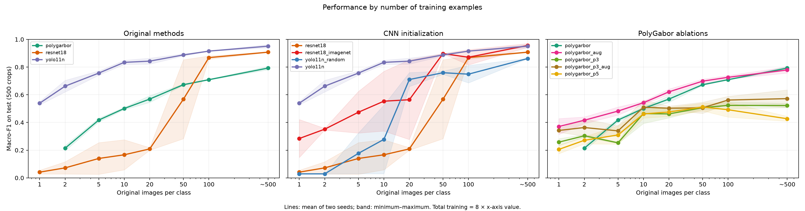
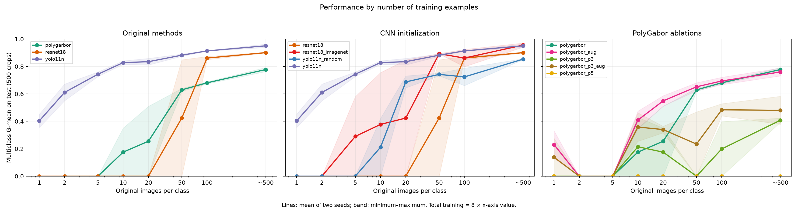
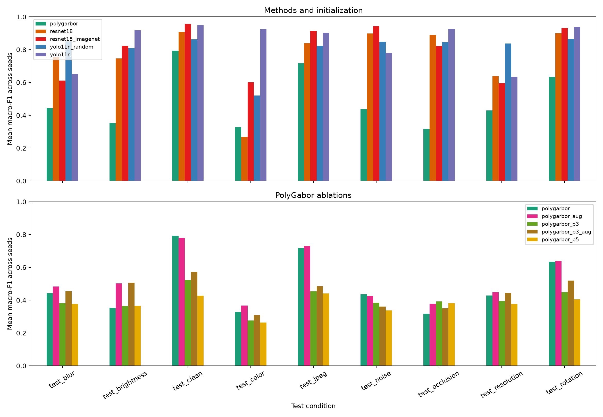
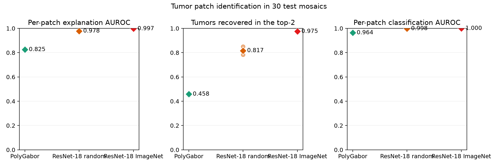
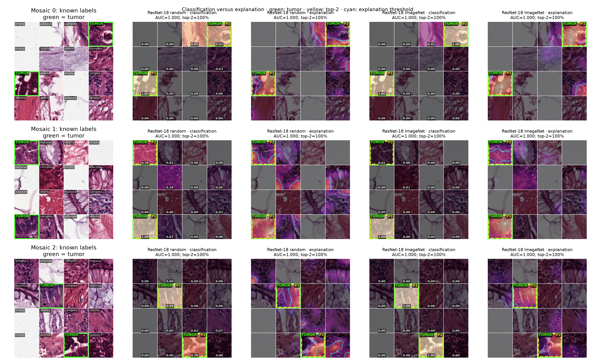

# Comparison of colorectal histopathology classifiers

Campaign `2026-09-12`. This file is generated from the saved artifacts; the visual assessment and detailed interpretation are in [DISCUSSION.md](DISCUSSION.md). There are 280 registered runs and 278 completed ones. See `run_index.csv` for failures and paths, `metrics.csv` for all metrics and `../../PROTOCOL.md` for the protocol.

## Clean test after full training

| method | seed | accuracy | macro_f1 | multiclass_gmean | balanced_accuracy | mcc | nll | ece |
| --- | --- | --- | --- | --- | --- | --- | --- | --- |
| polygarbor | 42 | 0.7860 | 0.7802 | 0.7624 | 0.7887 | 0.7604 | 0.8753 | 0.2759 |
| polygarbor | 43 | 0.8080 | 0.8054 | 0.7923 | 0.8123 | 0.7850 | 0.8629 | 0.2959 |
| polygarbor_aug | 42 | 0.8020 | 0.8014 | 0.7884 | 0.8070 | 0.7777 | 0.9841 | 0.3552 |
| polygarbor_aug | 43 | 0.7620 | 0.7568 | 0.7310 | 0.7690 | 0.7343 | 0.9639 | 0.3021 |
| polygarbor_p3 | 42 | 0.6020 | 0.5379 | 0.4234 | 0.6010 | 0.5638 | 1.1530 | 0.1940 |
| polygarbor_p3 | 43 | 0.5660 | 0.5071 | 0.3922 | 0.5665 | 0.5299 | 1.1318 | 0.1616 |
| polygarbor_p3_aug | 42 | 0.5620 | 0.5090 | 0.3780 | 0.5619 | 0.5297 | 1.1897 | 0.1767 |
| polygarbor_p3_aug | 43 | 0.6460 | 0.6354 | 0.5827 | 0.6523 | 0.6100 | 1.1781 | 0.2836 |
| polygarbor_p5 | 42 | 0.4960 | 0.4090 | 0.0000 | 0.4962 | 0.4539 | 1.3149 | 0.1492 |
| polygarbor_p5 | 43 | 0.5380 | 0.4449 | 0.0000 | 0.5392 | 0.4988 | 1.2855 | 0.1930 |
| resnet18 | 42 | 0.9060 | 0.9052 | 0.8976 | 0.9062 | 0.8929 | 0.2778 | 0.0179 |
| resnet18 | 43 | 0.9100 | 0.9103 | 0.9036 | 0.9099 | 0.8977 | 0.2793 | 0.0360 |
| resnet18_imagenet | 42 | 0.9700 | 0.9703 | 0.9707 | 0.9711 | 0.9658 | 0.1273 | 0.0170 |
| resnet18_imagenet | 43 | 0.9400 | 0.9419 | 0.9405 | 0.9420 | 0.9315 | 0.1923 | 0.0136 |
| yolo11n | 42 | 0.9620 | 0.9624 | 0.9627 | 0.9634 | 0.9567 | 0.1583 | 0.0220 |
| yolo11n | 43 | 0.9380 | 0.9396 | 0.9380 | 0.9403 | 0.9294 | 0.1821 | 0.0162 |
| yolo11n_random | 42 | 0.8600 | 0.8640 | 0.8563 | 0.8625 | 0.8406 | 0.3434 | 0.0323 |
| yolo11n_random | 43 | 0.8580 | 0.8596 | 0.8500 | 0.8585 | 0.8377 | 0.3655 | 0.0549 |

## ImageNet versus random configuration

| family | scenario | seeds | macro_f1_random | macro_f1_imagenet | macro_f1_delta_imagenet_minus_random | gmean_random | gmean_imagenet | gmean_delta_imagenet_minus_random |
| --- | --- | --- | --- | --- | --- | --- | --- | --- |
| ResNet-18 | few1 | 2 | 0.0414 | 0.2842 | 0.2428 | 0.0000 | 0.0000 | 0.0000 |
| ResNet-18 | few2 | 2 | 0.0721 | 0.3517 | 0.2795 | 0.0000 | 0.0000 | 0.0000 |
| ResNet-18 | few5 | 2 | 0.1402 | 0.4740 | 0.3338 | 0.0000 | 0.2899 | 0.2899 |
| ResNet-18 | few10 | 2 | 0.1667 | 0.5537 | 0.3870 | 0.0000 | 0.3776 | 0.3776 |
| ResNet-18 | few20 | 2 | 0.2091 | 0.5644 | 0.3552 | 0.0000 | 0.4238 | 0.4238 |
| ResNet-18 | few50 | 2 | 0.5679 | 0.8973 | 0.3295 | 0.4242 | 0.8926 | 0.4685 |
| ResNet-18 | few100 | 2 | 0.8684 | 0.8711 | 0.0027 | 0.8612 | 0.8611 | -0.0001 |
| ResNet-18 | full | 2 | 0.9078 | 0.9561 | 0.0483 | 0.9006 | 0.9556 | 0.0550 |
| ResNet-18 | imbalance | 1 | 0.7247 | 0.9044 | 0.1797 | 0.6546 | 0.8973 | 0.2427 |
| ResNet-18 | label_noise | 1 | 0.8831 | 0.8881 | 0.0050 | 0.8772 | 0.8820 | 0.0048 |
| ResNet-18 | source_a | 1 | 0.5407 | 0.4841 | -0.0566 | 0.4063 | 0.0000 | -0.4063 |
| ResNet-18 | source_b | 1 | 0.3444 | 0.6084 | 0.2640 | 0.0000 | 0.4619 | 0.4619 |
| YOLO11n | few1 | 2 | 0.0290 | 0.5392 | 0.5103 | 0.0000 | 0.4033 | 0.4033 |
| YOLO11n | few2 | 2 | 0.0290 | 0.6623 | 0.6333 | 0.0000 | 0.6106 | 0.6106 |
| YOLO11n | few5 | 2 | 0.1770 | 0.7567 | 0.5797 | 0.0000 | 0.7432 | 0.7432 |
| YOLO11n | few10 | 2 | 0.2778 | 0.8342 | 0.5564 | 0.2111 | 0.8281 | 0.6170 |
| YOLO11n | few20 | 2 | 0.7100 | 0.8430 | 0.1329 | 0.6874 | 0.8347 | 0.1473 |
| YOLO11n | few50 | 2 | 0.7594 | 0.8878 | 0.1283 | 0.7420 | 0.8821 | 0.1401 |
| YOLO11n | few100 | 2 | 0.7489 | 0.9154 | 0.1665 | 0.7238 | 0.9134 | 0.1895 |
| YOLO11n | full | 2 | 0.8618 | 0.9510 | 0.0892 | 0.8532 | 0.9504 | 0.0972 |
| YOLO11n | imbalance | 1 | 0.7124 | 0.9046 | 0.1921 | 0.0000 | 0.8987 | 0.8987 |
| YOLO11n | label_noise | 1 | 0.8581 | 0.9369 | 0.0788 | 0.8528 | 0.9347 | 0.0819 |
| YOLO11n | source_a | 1 | 0.5637 | 0.8295 | 0.2658 | 0.4467 | 0.8102 | 0.3635 |
| YOLO11n | source_b | 1 | 0.5063 | 0.8191 | 0.3127 | 0.0000 | 0.8282 | 0.8282 |

Each row compares the same architecture and scenario, pairing the available seeds. A positive delta favors the ImageNet configuration. For ResNet, it combines ImageNet weights with the matching input normalization; the contrast does not isolate the weights alone. For YOLO, architecture and training policy are kept and the intended difference is the origin of the weights. The curves and the localization show that the mean gain does not hold under every source shift.

## Full training cost

| method | seed | n_train | originals_retained | fitted_vectors_or_images | epochs | train_seconds | model_mb | rss_peak_mb | vram_peak_mb |
| --- | --- | --- | --- | --- | --- | --- | --- | --- | --- |
| polygarbor | 42 | 4000 | 2800 | 2800 | 0 | 21.1885 | 0.6508 | 1240.3139 | 0.0000 |
| polygarbor | 43 | 4000 | 2800 | 2800 | 0 | 19.9521 | 0.6507 | 1223.6186 | 0.0000 |
| polygarbor_aug | 42 | 4000 | 2170 | 2800 | 0 | 87.2951 | 0.6506 | 1263.0958 | 0.0000 |
| polygarbor_aug | 43 | 4000 | 2164 | 2800 | 0 | 70.0253 | 0.6503 | 1176.3302 | 0.0000 |
| polygarbor_p3 | 42 | 4000 | 2065 | 2800 | 0 | 29.7417 | 0.6492 | 1511.7230 | 0.0000 |
| polygarbor_p3 | 43 | 4000 | 2061 | 2800 | 0 | 28.5705 | 0.6493 | 1455.3784 | 0.0000 |
| polygarbor_p3_aug | 42 | 4000 | 2040 | 2800 | 0 | 106.4593 | 0.6488 | 1358.0329 | 0.0000 |
| polygarbor_p3_aug | 43 | 4000 | 2021 | 2800 | 0 | 90.7111 | 0.6491 | 1338.6015 | 0.0000 |
| polygarbor_p5 | 42 | 4000 | 2048 | 2800 | 0 | 40.1738 | 0.6478 | 1519.3702 | 0.0000 |
| polygarbor_p5 | 43 | 4000 | 2047 | 2800 | 0 | 33.1320 | 0.6479 | 1598.7999 | 0.0000 |
| resnet18 | 42 | 4000 | 4000 | 4000 | 26 | 145.9129 | 45.0087 | 3831.1076 | 2975.8587 |
| resnet18 | 43 | 4000 | 4000 | 4000 | 40 | 201.7962 | 45.0087 | 3859.4191 | 2975.8587 |
| resnet18_imagenet | 42 | 4000 | 4000 | 4000 | 42 | 214.5216 | 45.0117 | 4267.1636 | 3995.0746 |
| resnet18_imagenet | 43 | 4000 | 4000 | 4000 | 25 | 134.9958 | 45.0117 | 4261.3883 | 4049.6005 |
| yolo11n | 42 | 4000 | 4000 | 4000 | 28 | 307.7293 | 3.2040 | 3491.7622 | 799.0149 |
| yolo11n | 43 | 4000 | 4000 | 4000 | 21 | 231.8851 | 3.2035 | 3467.5835 | 706.7402 |
| yolo11n_random | 42 | 4000 | 4000 | 4000 | 25 | 256.2982 | 3.2038 | 3471.2945 | 767.5576 |
| yolo11n_random | 43 | 4000 | 4000 | 4000 | 27 | 277.4732 | 3.2039 | 3470.1435 | 788.5292 |

MB uses 1,000,000 bytes. RAM and VRAM are peaks of the whole process, including evaluation and figures; per-stage costs are in [stage_resources.csv](stage_resources.csv) and in each run's resources.json/timings.json. GPU-% is device-wide, including the desktop. CPU-% uses 100% per core. Default PolyGabor extracts 4000 vectors but fits at most 2800. In the variants, 9/25 patches and augmentation enlarge the candidate vectors while keeping the cap of 350 per class; originals_retained reports how many distinct original images reach the fit. effective_training.json details the per-class values. This changes spatial scale and retained diversity at the same time, which must be considered when interpreting the ablations.

## CPU and GPU usage during fitting

| method | seed | training_cpu_core_percent | fit_cpu_core_percent | fit_gpu_global_percent | vram_peak_mb |
| --- | --- | --- | --- | --- | --- |
| polygarbor | 42 | 106.7558 | 304.7667 | 24.6667 | 0.0000 |
| polygarbor | 43 | 106.3548 | 305.2500 | 43.0000 | 0.0000 |
| polygarbor_aug | 42 | 101.6323 | 305.3000 | 46.0000 | 0.0000 |
| polygarbor_aug | 43 | 101.7061 | 333.5000 | 0.0000 | 0.0000 |
| polygarbor_p3 | 42 | 105.8781 | 337.3000 | 72.0000 | 0.0000 |
| polygarbor_p3 | 43 | 106.0884 | 329.6000 | 82.0000 | 0.0000 |
| polygarbor_p3_aug | 42 | 101.7385 | 376.3000 | 62.0000 | 0.0000 |
| polygarbor_p3_aug | 43 | 101.6744 | 308.5500 | 37.0000 | 0.0000 |
| polygarbor_p5 | 42 | 105.8651 | 381.0000 | 46.0000 | 0.0000 |
| polygarbor_p5 | 43 | 105.0043 | 354.4000 | 0.0000 | 0.0000 |
| resnet18 | 42 | 60.4128 | 59.2966 | 87.4245 | 2975.8587 |
| resnet18 | 43 | 60.2935 | 59.3647 | 87.2599 | 2975.8587 |
| resnet18_imagenet | 42 | 69.8531 | 68.9015 | 89.6123 | 3995.0746 |
| resnet18_imagenet | 43 | 72.1060 | 70.6696 | 87.0389 | 4049.6005 |
| yolo11n | 42 | 349.6839 | 365.0533 | 46.4851 | 799.0149 |
| yolo11n | 43 | 344.1662 | 364.9997 | 39.5127 | 706.7402 |
| yolo11n_random | 42 | 348.6797 | 364.9806 | 38.7645 | 767.5576 |
| yolo11n_random | 43 | 349.9257 | 364.7859 | 38.5412 | 788.5292 |

training_cpu_core_percent uses CPU-seconds divided by the total time of the training stages; 100% corresponds to one busy core. fit_cpu_core_percent is the mean sampled during fitting only. GPU-% is device-wide utilization, not exclusive to the process: desktop activity shows up even during PolyGabor. Per-PID VRAM is measured separately; PolyGabor runs no GPU operations.

## Learning curve

[Interpretation differences between G-mean and macro-F1](../../GMEAN_VS_MACRO_F1.md). The x-axis always counts original images, without inflating the budget with augmentations or patches.

The band shows the minimum and maximum across two seeds, when available; it is not a confidence interval. The ~500 point has 488–513 available examples per class, with an effective cap of 350 vectors/class in default PolyGabor. A point missing because of a fitting failure is not equivalent to zero F1. Validation keeps 500 labeled examples even in the scenarios with very few training examples; this is a training-scarcity curve, not a total annotation budget curve.

## Test robustness

| evaluation | polygarbor | polygarbor_aug | polygarbor_p3 | polygarbor_p3_aug | polygarbor_p5 | resnet18 | resnet18_imagenet | yolo11n | yolo11n_random |
| --- | --- | --- | --- | --- | --- | --- | --- | --- | --- |
| test_blur | 0.4429 | 0.4829 | 0.3819 | 0.4543 | 0.3773 | 0.7538 | 0.6110 | 0.6509 | 0.8503 |
| test_brightness | 0.3525 | 0.5021 | 0.3642 | 0.5063 | 0.3658 | 0.7464 | 0.8234 | 0.9189 | 0.8096 |
| test_clean | 0.7928 | 0.7791 | 0.5225 | 0.5722 | 0.4269 | 0.9078 | 0.9561 | 0.9510 | 0.8618 |
| test_color | 0.3275 | 0.3679 | 0.2757 | 0.3093 | 0.2641 | 0.2682 | 0.5999 | 0.9252 | 0.5200 |
| test_jpeg | 0.7171 | 0.7289 | 0.4531 | 0.4853 | 0.4406 | 0.8390 | 0.9138 | 0.9029 | 0.8235 |
| test_noise | 0.4369 | 0.4245 | 0.3846 | 0.3612 | 0.3373 | 0.8985 | 0.9421 | 0.7791 | 0.8488 |
| test_occlusion | 0.3166 | 0.3786 | 0.3919 | 0.3499 | 0.3806 | 0.8897 | 0.8221 | 0.9263 | 0.8450 |
| test_resolution | 0.4291 | 0.4489 | 0.3939 | 0.4436 | 0.3772 | 0.6375 | 0.5958 | 0.6353 | 0.8370 |
| test_rotation | 0.6335 | 0.6383 | 0.4480 | 0.5198 | 0.4052 | 0.9003 | 0.9312 | 0.9401 | 0.8641 |

The perturbations have fixed severity and identical pixel pairs across models, and do not represent external datasets or new patients. The additional source_a/source_b evaluation tests separate sources and is not mixed with these perturbations. See the parameters in scenarios.py.

## PolyGabor spatial aggregation

| method | scenario | seed | voting_macro_f1 | ranking_macro_f1 | voting_gmean | ranking_gmean | agreement |
| --- | --- | --- | --- | --- | --- | --- | --- |
| polygarbor | full | 42 | 0.7802 | 0.7802 | 0.7624 | 0.7624 | 1.0000 |
| polygarbor | full | 43 | 0.8054 | 0.8054 | 0.7923 | 0.7923 | 1.0000 |
| polygarbor_aug | full | 42 | 0.8014 | 0.8014 | 0.7884 | 0.7884 | 1.0000 |
| polygarbor_aug | full | 43 | 0.7568 | 0.7568 | 0.7310 | 0.7310 | 1.0000 |
| polygarbor_p3 | full | 42 | 0.5379 | 0.5009 | 0.4234 | 0.3484 | 0.8560 |
| polygarbor_p3 | full | 43 | 0.5071 | 0.5161 | 0.3922 | 0.3918 | 0.8800 |
| polygarbor_p3_aug | full | 42 | 0.5090 | 0.4834 | 0.3780 | 0.3930 | 0.8660 |
| polygarbor_p3_aug | full | 43 | 0.6354 | 0.6050 | 0.5827 | 0.5689 | 0.8320 |
| polygarbor_p5 | full | 42 | 0.4090 | 0.3871 | 0.0000 | 0.0000 | 0.8440 |
| polygarbor_p5 | full | 43 | 0.4449 | 0.4692 | 0.0000 | 0.0000 | 0.8220 |

Additional comparison without retraining: the main decision uses voting across regions; ranking uses the argmax of the normalized similarity of the mean distances. The main curves keep the voting fixed in the protocol. This analysis shows whether disagreement between regions explains part of the result; it was not used to retrospectively choose the best rule on the test set.

## Paired comparisons

| a | b | seed | accuracy_b_minus_a | ci_low | ci_high | source_cluster_ci_low | source_cluster_ci_high | only_a | only_b | mcnemar_exact_p | holm_p |
| --- | --- | --- | --- | --- | --- | --- | --- | --- | --- | --- | --- |
| polygarbor | polygarbor_aug | 42 | 0.0160 | -0.0100 | 0.0420 | -0.0213 | 0.0458 | 17 | 25 | 0.2800 | 0.8399 |
| polygarbor | polygarbor_p3 | 42 | -0.1840 | -0.2260 | -0.1420 | -0.3197 | -0.0639 | 112 | 20 | 0.0000 | 0.0000 |
| polygarbor | polygarbor_p3_aug | 42 | -0.2240 | -0.2660 | -0.1820 | -0.2900 | -0.1505 | 127 | 15 | 0.0000 | 0.0000 |
| polygarbor | polygarbor_p5 | 42 | -0.2900 | -0.3340 | -0.2460 | -0.4065 | -0.1748 | 155 | 10 | 0.0000 | 0.0000 |
| polygarbor | resnet18 | 42 | 0.1200 | 0.0800 | 0.1600 | 0.0563 | 0.1607 | 27 | 87 | 0.0000 | 0.0000 |
| polygarbor | resnet18_imagenet | 42 | 0.1840 | 0.1460 | 0.2220 | 0.1393 | 0.2184 | 5 | 97 | 0.0000 | 0.0000 |
| polygarbor | yolo11n | 42 | 0.1760 | 0.1400 | 0.2120 | 0.1429 | 0.2031 | 5 | 93 | 0.0000 | 0.0000 |
| polygarbor | yolo11n_random | 42 | 0.0740 | 0.0340 | 0.1160 | 0.0178 | 0.1138 | 39 | 76 | 0.0007 | 0.0079 |
| polygarbor_aug | polygarbor_p3 | 42 | -0.2000 | -0.2420 | -0.1580 | -0.3586 | -0.0684 | 116 | 16 | 0.0000 | 0.0000 |
| polygarbor_aug | polygarbor_p3_aug | 42 | -0.2400 | -0.2840 | -0.1960 | -0.3230 | -0.1575 | 137 | 17 | 0.0000 | 0.0000 |
| polygarbor_aug | polygarbor_p5 | 42 | -0.3060 | -0.3520 | -0.2600 | -0.4437 | -0.1815 | 165 | 12 | 0.0000 | 0.0000 |
| polygarbor_aug | resnet18 | 42 | 0.1040 | 0.0660 | 0.1420 | 0.0509 | 0.1444 | 24 | 76 | 0.0000 | 0.0000 |
| polygarbor_aug | resnet18_imagenet | 42 | 0.1680 | 0.1340 | 0.2020 | 0.1283 | 0.2097 | 4 | 88 | 0.0000 | 0.0000 |
| polygarbor_aug | yolo11n | 42 | 0.1600 | 0.1260 | 0.1960 | 0.1248 | 0.2015 | 6 | 86 | 0.0000 | 0.0000 |
| polygarbor_aug | yolo11n_random | 42 | 0.0580 | 0.0200 | 0.0960 | 0.0130 | 0.1055 | 35 | 64 | 0.0046 | 0.0418 |
| polygarbor_p3 | polygarbor_p3_aug | 42 | -0.0400 | -0.0740 | -0.0060 | -0.1175 | 0.0422 | 48 | 28 | 0.0286 | 0.1718 |
| polygarbor_p3 | polygarbor_p5 | 42 | -0.1060 | -0.1400 | -0.0720 | -0.1520 | -0.0650 | 67 | 14 | 0.0000 | 0.0000 |
| polygarbor_p3 | resnet18 | 42 | 0.3040 | 0.2540 | 0.3520 | 0.1726 | 0.4578 | 24 | 176 | 0.0000 | 0.0000 |
| polygarbor_p3 | resnet18_imagenet | 42 | 0.3680 | 0.3240 | 0.4100 | 0.2695 | 0.4907 | 3 | 187 | 0.0000 | 0.0000 |
| polygarbor_p3 | yolo11n | 42 | 0.3600 | 0.3160 | 0.4040 | 0.2468 | 0.4894 | 6 | 186 | 0.0000 | 0.0000 |
| polygarbor_p3 | yolo11n_random | 42 | 0.2580 | 0.2080 | 0.3080 | 0.1087 | 0.4157 | 32 | 161 | 0.0000 | 0.0000 |
| polygarbor_p3_aug | polygarbor_p5 | 42 | -0.0660 | -0.0960 | -0.0360 | -0.1265 | -0.0090 | 45 | 12 | 0.0000 | 0.0002 |
| polygarbor_p3_aug | resnet18 | 42 | 0.3440 | 0.2940 | 0.3920 | 0.2423 | 0.4276 | 18 | 190 | 0.0000 | 0.0000 |
| polygarbor_p3_aug | resnet18_imagenet | 42 | 0.4080 | 0.3620 | 0.4520 | 0.3396 | 0.4610 | 3 | 207 | 0.0000 | 0.0000 |
| polygarbor_p3_aug | yolo11n | 42 | 0.4000 | 0.3540 | 0.4460 | 0.3318 | 0.4567 | 4 | 204 | 0.0000 | 0.0000 |
| polygarbor_p3_aug | yolo11n_random | 42 | 0.2980 | 0.2480 | 0.3460 | 0.1954 | 0.3844 | 27 | 176 | 0.0000 | 0.0000 |
| polygarbor_p5 | resnet18 | 42 | 0.4100 | 0.3600 | 0.4580 | 0.2654 | 0.5506 | 16 | 221 | 0.0000 | 0.0000 |
| polygarbor_p5 | resnet18_imagenet | 42 | 0.4740 | 0.4280 | 0.5180 | 0.3641 | 0.5803 | 4 | 241 | 0.0000 | 0.0000 |
| polygarbor_p5 | yolo11n | 42 | 0.4660 | 0.4200 | 0.5120 | 0.3520 | 0.5784 | 3 | 236 | 0.0000 | 0.0000 |
| polygarbor_p5 | yolo11n_random | 42 | 0.3640 | 0.3120 | 0.4140 | 0.2156 | 0.5052 | 27 | 209 | 0.0000 | 0.0000 |
| resnet18 | resnet18_imagenet | 42 | 0.0640 | 0.0400 | 0.0900 | 0.0282 | 0.1074 | 5 | 37 | 0.0000 | 0.0000 |
| resnet18 | yolo11n | 42 | 0.0560 | 0.0320 | 0.0820 | 0.0226 | 0.1011 | 8 | 36 | 0.0000 | 0.0004 |
| resnet18 | yolo11n_random | 42 | -0.0460 | -0.0740 | -0.0180 | -0.0881 | -0.0023 | 38 | 15 | 0.0022 | 0.0219 |
| resnet18_imagenet | yolo11n | 42 | -0.0080 | -0.0240 | 0.0080 | -0.0328 | 0.0177 | 11 | 7 | 0.4807 | 0.9614 |
| resnet18_imagenet | yolo11n_random | 42 | -0.1100 | -0.1380 | -0.0820 | -0.1670 | -0.0633 | 59 | 4 | 0.0000 | 0.0000 |
| yolo11n | yolo11n_random | 42 | -0.1020 | -0.1340 | -0.0720 | -0.1468 | -0.0663 | 60 | 9 | 0.0000 | 0.0000 |
| polygarbor | polygarbor_aug | 43 | -0.0460 | -0.0700 | -0.0220 | -0.0836 | -0.0171 | 31 | 8 | 0.0003 | 0.0038 |
| polygarbor | polygarbor_p3 | 43 | -0.2420 | -0.2840 | -0.2000 | -0.3400 | -0.1473 | 137 | 16 | 0.0000 | 0.0000 |
| polygarbor | polygarbor_p3_aug | 43 | -0.1620 | -0.2020 | -0.1240 | -0.2087 | -0.1149 | 98 | 17 | 0.0000 | 0.0000 |
| polygarbor | polygarbor_p5 | 43 | -0.2700 | -0.3120 | -0.2280 | -0.4112 | -0.1435 | 146 | 11 | 0.0000 | 0.0000 |
| polygarbor | resnet18 | 43 | 0.1020 | 0.0660 | 0.1400 | 0.0594 | 0.1313 | 22 | 73 | 0.0000 | 0.0000 |
| polygarbor | resnet18_imagenet | 43 | 0.1320 | 0.0960 | 0.1700 | 0.0914 | 0.1548 | 14 | 80 | 0.0000 | 0.0000 |
| polygarbor | yolo11n | 43 | 0.1300 | 0.0980 | 0.1640 | 0.0930 | 0.1550 | 9 | 74 | 0.0000 | 0.0000 |
| polygarbor | yolo11n_random | 43 | 0.0500 | 0.0120 | 0.0880 | 0.0136 | 0.0715 | 36 | 61 | 0.0144 | 0.1151 |
| polygarbor_aug | polygarbor_p3 | 43 | -0.1960 | -0.2380 | -0.1540 | -0.3196 | -0.0821 | 118 | 20 | 0.0000 | 0.0000 |
| polygarbor_aug | polygarbor_p3_aug | 43 | -0.1160 | -0.1560 | -0.0760 | -0.1798 | -0.0447 | 83 | 25 | 0.0000 | 0.0000 |
| polygarbor_aug | polygarbor_p5 | 43 | -0.2240 | -0.2660 | -0.1820 | -0.3889 | -0.0796 | 129 | 17 | 0.0000 | 0.0000 |
| polygarbor_aug | resnet18 | 43 | 0.1480 | 0.1080 | 0.1880 | 0.1163 | 0.1815 | 20 | 94 | 0.0000 | 0.0000 |
| polygarbor_aug | resnet18_imagenet | 43 | 0.1780 | 0.1400 | 0.2160 | 0.1540 | 0.2058 | 10 | 99 | 0.0000 | 0.0000 |
| polygarbor_aug | yolo11n | 43 | 0.1760 | 0.1400 | 0.2140 | 0.1484 | 0.2068 | 8 | 96 | 0.0000 | 0.0000 |
| polygarbor_aug | yolo11n_random | 43 | 0.0960 | 0.0580 | 0.1360 | 0.0759 | 0.1224 | 31 | 79 | 0.0000 | 0.0001 |
| polygarbor_p3 | polygarbor_p3_aug | 43 | 0.0800 | 0.0460 | 0.1140 | 0.0076 | 0.1527 | 22 | 62 | 0.0000 | 0.0002 |
| polygarbor_p3 | polygarbor_p5 | 43 | -0.0280 | -0.0560 | 0.0000 | -0.0732 | 0.0124 | 31 | 17 | 0.0595 | 0.2438 |
| polygarbor_p3 | resnet18 | 43 | 0.3440 | 0.2960 | 0.3920 | 0.2352 | 0.4460 | 16 | 188 | 0.0000 | 0.0000 |
| polygarbor_p3 | resnet18_imagenet | 43 | 0.3740 | 0.3260 | 0.4200 | 0.2667 | 0.4803 | 12 | 199 | 0.0000 | 0.0000 |
| polygarbor_p3 | yolo11n | 43 | 0.3720 | 0.3280 | 0.4160 | 0.2677 | 0.4760 | 5 | 191 | 0.0000 | 0.0000 |
| polygarbor_p3 | yolo11n_random | 43 | 0.2920 | 0.2420 | 0.3380 | 0.1775 | 0.4055 | 24 | 170 | 0.0000 | 0.0000 |
| polygarbor_p3_aug | polygarbor_p5 | 43 | -0.1080 | -0.1460 | -0.0700 | -0.2243 | -0.0022 | 80 | 26 | 0.0000 | 0.0000 |
| polygarbor_p3_aug | resnet18 | 43 | 0.2640 | 0.2200 | 0.3080 | 0.2014 | 0.3178 | 14 | 146 | 0.0000 | 0.0000 |
| polygarbor_p3_aug | resnet18_imagenet | 43 | 0.2940 | 0.2500 | 0.3380 | 0.2365 | 0.3420 | 8 | 155 | 0.0000 | 0.0000 |
| polygarbor_p3_aug | yolo11n | 43 | 0.2920 | 0.2500 | 0.3340 | 0.2382 | 0.3381 | 4 | 150 | 0.0000 | 0.0000 |
| polygarbor_p3_aug | yolo11n_random | 43 | 0.2120 | 0.1680 | 0.2580 | 0.1502 | 0.2683 | 23 | 129 | 0.0000 | 0.0000 |
| polygarbor_p5 | resnet18 | 43 | 0.3720 | 0.3240 | 0.4180 | 0.2308 | 0.5170 | 17 | 203 | 0.0000 | 0.0000 |
| polygarbor_p5 | resnet18_imagenet | 43 | 0.4020 | 0.3560 | 0.4480 | 0.2635 | 0.5531 | 11 | 212 | 0.0000 | 0.0000 |
| polygarbor_p5 | yolo11n | 43 | 0.4000 | 0.3560 | 0.4440 | 0.2626 | 0.5472 | 6 | 206 | 0.0000 | 0.0000 |
| polygarbor_p5 | yolo11n_random | 43 | 0.3200 | 0.2720 | 0.3680 | 0.1768 | 0.4754 | 24 | 184 | 0.0000 | 0.0000 |
| resnet18 | resnet18_imagenet | 43 | 0.0300 | 0.0080 | 0.0540 | 0.0124 | 0.0463 | 10 | 25 | 0.0167 | 0.1167 |
| resnet18 | yolo11n | 43 | 0.0280 | 0.0020 | 0.0540 | 0.0086 | 0.0428 | 15 | 29 | 0.0488 | 0.2438 |
| resnet18 | yolo11n_random | 43 | -0.0520 | -0.0800 | -0.0260 | -0.0862 | -0.0204 | 38 | 12 | 0.0003 | 0.0038 |
| resnet18_imagenet | yolo11n | 43 | -0.0020 | -0.0220 | 0.0200 | -0.0181 | 0.0164 | 15 | 14 | 1.0000 | 1.0000 |
| resnet18_imagenet | yolo11n_random | 43 | -0.0820 | -0.1120 | -0.0540 | -0.1034 | -0.0596 | 49 | 8 | 0.0000 | 0.0000 |
| yolo11n | yolo11n_random | 43 | -0.0800 | -0.1100 | -0.0520 | -0.1094 | -0.0548 | 51 | 11 | 0.0000 | 0.0000 |

Difference = accuracy of B minus A. Paired bootstrap with 5000 crop resamples; exact McNemar and Holm adjustment across the pairs/seeds shown. A paired bootstrap over ten source groups is also reported, resampling all crops of each source together. This interval accounts for dependence within a source and should be preferred over the crop-level one. McNemar and its Holm adjustment remain exploratory because independence between crops is not guaranteed. None of these analyses demonstrates clinical generalization.

## Calibration

| method | seed | temperature | nll | brier | ece | accuracy |
| --- | --- | --- | --- | --- | --- | --- |
| polygarbor | 42 | 0.3148 | 0.7099 | 0.3264 | 0.0683 | 0.7860 |
| polygarbor | 43 | 0.2999 | 0.6601 | 0.3041 | 0.0749 | 0.8080 |
| polygarbor_aug | 42 | 0.1933 | 0.7018 | 0.3170 | 0.0780 | 0.8020 |
| polygarbor_aug | 43 | 0.2690 | 0.7435 | 0.3538 | 0.0690 | 0.7620 |
| polygarbor_p3 | 42 | 0.4666 | 1.0624 | 0.5117 | 0.0807 | 0.6020 |
| polygarbor_p3 | 43 | 0.4258 | 0.9953 | 0.5006 | 0.0713 | 0.5660 |
| polygarbor_p3_aug | 42 | 0.4163 | 1.0623 | 0.5401 | 0.0413 | 0.5620 |
| polygarbor_p3_aug | 43 | 0.3010 | 0.9764 | 0.4867 | 0.0764 | 0.6460 |
| polygarbor_p5 | 42 | 0.6069 | 1.2455 | 0.6087 | 0.1374 | 0.4960 |
| polygarbor_p5 | 43 | 0.5452 | 1.2066 | 0.5778 | 0.1047 | 0.5380 |
| resnet18 | 42 | 0.9764 | 0.2788 | 0.1385 | 0.0174 | 0.9060 |
| resnet18 | 43 | 1.1903 | 0.2629 | 0.1353 | 0.0221 | 0.9100 |
| resnet18_imagenet | 42 | 1.7798 | 0.1076 | 0.0510 | 0.0117 | 0.9700 |
| resnet18_imagenet | 43 | 1.0916 | 0.1886 | 0.0891 | 0.0230 | 0.9400 |
| yolo11n | 42 | 0.8764 | 0.1603 | 0.0719 | 0.0175 | 0.9620 |
| yolo11n | 43 | 0.9528 | 0.1831 | 0.0942 | 0.0169 | 0.9380 |
| yolo11n_random | 42 | 0.9356 | 0.3404 | 0.1902 | 0.0290 | 0.8600 |
| yolo11n_random | 43 | 0.8695 | 0.3598 | 0.1983 | 0.0389 | 0.8580 |

Temperature fitted exclusively on validation for each run and applied to the test set without changing the winning class. The original scores are CNN softmax and PolyGabor normalized heuristic similarity; the PolyGabor vote fraction is not used as a probability. AUROC/top-2 measure ranking; NLL/Brier/ECE need this caveat. See metrics.csv for the values before calibration.

## Edge and inference

| method | mode | median_ms | p95_ms | model_mb | rss_peak_mb | vram_peak_mb | load_seconds | first_prediction_seconds | cold_total_seconds | batch32_images_s |
| --- | --- | --- | --- | --- | --- | --- | --- | --- | --- | --- |
| polygarbor | cpu1 | 19.0296 | 25.6946 | 0.6508 | 280.1377 | 0.0000 | 0.9850 | 0.0764 | 1.3776 | 52.6754 |
| polygarbor | cpu4 | 19.4757 | 21.0303 | 0.6508 | 281.6164 | 0.0000 | 1.0349 | 0.0830 | 1.4224 | 50.4820 |
| polygarbor_aug | cpu1 | 17.5472 | 18.1265 | 0.6506 | 266.3547 | 0.0000 | 0.9593 | 0.1600 | 1.2635 | 54.0325 |
| polygarbor_aug | cpu4 | 18.1017 | 19.3279 | 0.6506 | 290.3572 | 0.0000 | 1.0536 | 0.1052 | 1.4750 | 53.7098 |
| polygarbor_p3 | cpu1 | 27.5612 | 30.7611 | 0.6492 | 318.1117 | 0.0000 | 1.1928 | 0.0854 | 1.5043 | 35.8461 |
| polygarbor_p3 | cpu4 | 31.1329 | 34.9254 | 0.6492 | 319.5617 | 0.0000 | 1.1546 | 0.0905 | 1.5563 | 29.2649 |
| polygarbor_p3_aug | cpu1 | 26.1330 | 27.2088 | 0.6488 | 307.7161 | 0.0000 | 1.0923 | 0.0842 | 1.3878 | 36.5434 |
| polygarbor_p3_aug | cpu4 | 32.5499 | 34.6165 | 0.6488 | 299.7043 | 0.0000 | 1.1679 | 0.1081 | 1.5209 | 27.5407 |
| polygarbor_p5 | cpu1 | 34.1177 | 36.5554 | 0.6478 | 301.5393 | 0.0000 | 1.2360 | 0.0912 | 1.4900 | 28.5747 |
| polygarbor_p5 | cpu4 | 42.9941 | 46.6326 | 0.6478 | 299.0572 | 0.0000 | 1.1724 | 0.1062 | 1.5367 | 24.3747 |
| resnet18 | cpu1 | 20.1934 | 21.9657 | 45.0087 | 939.3480 | 0.0000 | 2.6812 | 0.2565 | 3.6353 | 92.7586 |
| resnet18 | cpu4 | 8.1954 | 13.7602 | 45.0087 | 946.1105 | 0.0000 | 2.7462 | 0.2598 | 3.7769 | 263.0014 |
| resnet18 | gpu | 2.4785 | 3.0298 | 45.0087 | 1644.9331 | 4324.3274 | 3.4819 | 0.7446 | 4.8488 | 277.0435 |
| resnet18_imagenet | cpu1 | 20.7272 | 21.8705 | 45.0117 | 945.8729 | 0.0000 | 2.6935 | 0.2638 | 3.9953 | 91.5604 |
| resnet18_imagenet | cpu4 | 9.5494 | 13.0114 | 45.0117 | 950.7676 | 0.0000 | 2.7943 | 0.2636 | 3.8404 | 233.5879 |
| resnet18_imagenet | gpu | 3.0801 | 4.4250 | 45.0117 | 1607.0124 | 2430.5992 | 3.4279 | 0.7329 | 5.0715 | 226.7010 |
| yolo11n | cpu1 | 3.3195 | 3.7552 | 3.2040 | 824.9958 | 0.0000 | 2.4236 | 0.0497 | 3.2180 | 480.3991 |
| yolo11n | cpu4 | 2.8806 | 3.1126 | 3.2040 | 835.9977 | 0.0000 | 2.3038 | 0.0527 | 3.2147 | 814.1773 |
| yolo11n | gpu | 2.4858 | 3.2174 | 3.2040 | 1521.0619 | 251.6582 | 2.2869 | 0.6445 | 3.8036 | 1638.2339 |
| yolo11n_random | cpu1 | 3.5999 | 3.9950 | 3.2038 | 853.2869 | 0.0000 | 2.4601 | 0.0410 | 3.3002 | 450.3960 |
| yolo11n_random | cpu4 | 2.8881 | 3.6556 | 3.2038 | 818.0040 | 0.0000 | 2.4361 | 0.0439 | 3.2627 | 888.2204 |
| yolo11n_random | gpu | 2.6548 | 3.8473 | 3.2038 | 1528.7910 | 251.6582 | 2.4142 | 0.5726 | 3.8944 | 1623.8501 |

cpu1 restricts affinity to one logical processor and libraries to one thread; cpu4 uses four threads; gpu uses the local RTX. Each measurement reloads the model in a separate process and warms up before measuring latency. Images are already in RAM: latency includes preprocessing and execution but excludes file reading and visualizations. There is no ARM emulation and no artificial RAM limit. The process approximates a computational constraint on x86; it is not a benchmark on a real edge device.

## Generalization by source

| method | scenario | n_train | accuracy | macro_f1 | multiclass_gmean | balanced_accuracy |
| --- | --- | --- | --- | --- | --- | --- |
| polygarbor | source_a | 4031 | 0.7293 | 0.7544 | 0.7501 | 0.7698 |
| polygarbor_aug | source_a | 4031 | 0.7138 | 0.7330 | 0.7031 | 0.7593 |
| polygarbor_p3 | source_a | 4031 | 0.5345 | 0.4715 | 0.0000 | 0.5501 |
| polygarbor_p3_aug | source_a | 4031 | 0.5328 | 0.4928 | 0.0000 | 0.5473 |
| polygarbor_p5 | source_a | 4031 | 0.4017 | 0.3365 | 0.0000 | 0.4310 |
| resnet18 | source_a | 4031 | 0.5948 | 0.5407 | 0.4063 | 0.5683 |
| resnet18_imagenet | source_a | 4031 | 0.5879 | 0.4841 | 0.0000 | 0.5340 |
| yolo11n | source_a | 4031 | 0.8069 | 0.8295 | 0.8102 | 0.8246 |
| yolo11n_random | source_a | 4031 | 0.5483 | 0.5637 | 0.4467 | 0.6219 |
| polygarbor | source_b | 3208 | 0.3970 | 0.5000 | 0.0000 | 0.6283 |
| polygarbor_aug | source_b | 3208 | 0.5282 | 0.5692 | 0.6112 | 0.6615 |
| polygarbor_p3 | source_b | 3208 | 0.3100 | 0.3907 | 0.0000 | 0.5189 |
| polygarbor_p3_aug | source_b | 3208 | 0.3065 | 0.3733 | 0.0000 | 0.4833 |
| polygarbor_p5 | source_b | 3208 | 0.2644 | 0.3231 | 0.0000 | 0.4302 |
| resnet18 | source_b | 3208 | 0.3022 | 0.3444 | 0.0000 | 0.4413 |
| resnet18_imagenet | source_b | 3208 | 0.7719 | 0.6084 | 0.4619 | 0.6497 |
| yolo11n | source_b | 3208 | 0.8831 | 0.8191 | 0.8282 | 0.8476 |
| yolo11n_random | source_b | 3208 | 0.4298 | 0.5063 | 0.0000 | 0.6246 |

Sources were recovered from the file names through SHA-256 of the pixels. source_a tests 09/10 and source_b tests 06/09; validation on 08, with the remaining sources in training. The empty class exists only in 06/10, which makes its presence in three disjoint splits at once impossible. Validation 08 contains no adipose/empty; training and test keep eight classes. The test sets differ in size/composition from the random test, so differences do not isolate the effect of source alone. Patient identity by code was not confirmed. The main source analysis is now leave-one-source-out, in [loso/README.md](loso/README.md); source_a/source_b are kept as a historical record.

## Quantitative localization

| method | seed | explanation AUROC | explanation AP | top-2 recall | both in top-2 | classifier AUROC |
| --- | --- | --- | --- | --- | --- | --- |
| polygarbor | 42 | 0.8274 | 0.3640 | 0.4667 | 0.1667 | 0.9638 |
| polygarbor | 43 | 0.8233 | 0.3543 | 0.4500 | 0.1667 | 0.9641 |
| resnet18 | 42 | 0.9703 | 0.7195 | 0.7833 | 0.5667 | 0.9981 |
| resnet18 | 43 | 0.9860 | 0.9158 | 0.8500 | 0.7000 | 0.9984 |
| resnet18_imagenet | 42 | 0.9980 | 0.9868 | 0.9833 | 0.9667 | 0.9997 |
| resnet18_imagenet | 43 | 0.9964 | 0.9806 | 0.9667 | 0.9333 | 0.9996 |

Each 4×4 mosaic contains two tumor patches and fourteen patches from the other classes, with no repetition within the split. Maps are computed on each isolated patch and reassembled without mixing between neighbors. The primary evaluation compares the explanatory evidence with the known per-patch labels; pixel-level region metrics are secondary because there is no internal annotation. Protocol, examples and limitations are in the [localization report](localization/README.md).

## Artifacts and limits

The splits are the original TFDS ones (4000/500/500) with deterministic order, auditable hashes and no exact duplicates across splits. Supervised loading exposes image/label. The audit recovered ten sources from the filenames and added source_a/source_b splits with separate sources, described in source_manifest.json. There is no clinical patient identification and no test on an external dataset. ResNet-18 and YOLO11n were run with random and ImageNet initialization; the augmentation policy and optimizer remain specific to each pipeline.

Each run has config.json, selection.json, status.json, run.log, timings.json, resources.csv/json, the model, per-image metrics/predictions and figures. History and epochs are saved for the CNNs. Pilots live in separate campaigns and do not enter the tables. Large models and data remain on disk, ignored by Git.

Sources: [TFDS dataset](https://www.tensorflow.org/datasets/catalog/colorectal_histology), [original data](https://zenodo.org/records/53169), [Ultralytics classification](https://docs.ultralytics.com/tasks/classify/), [activation map reference](https://keras.io/examples/vision/grad_cam/).
