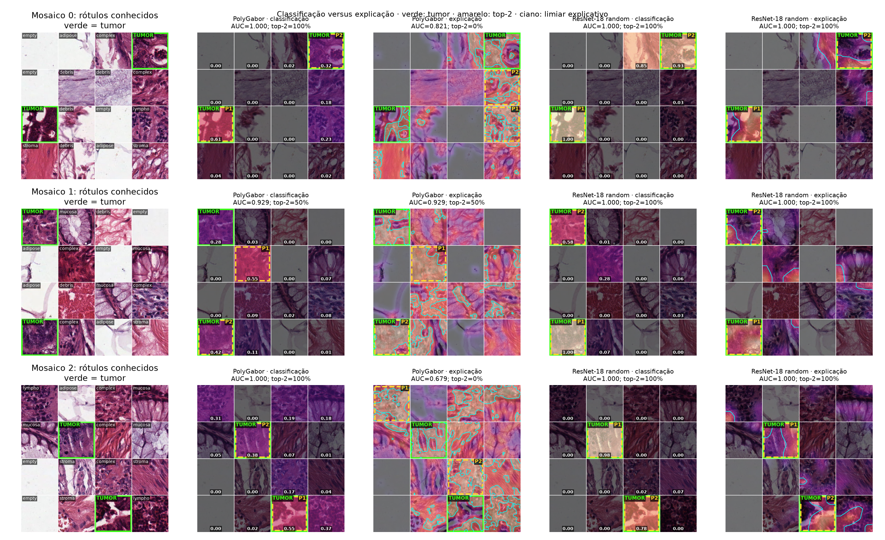

# Localização quantitativa de tumor em mosaicos

Foram avaliados 20 mosaicos de validação e 30 de teste, todos 4×4 e 600×600 pixels, com dois patches de tumor e quatorze não tumorais. Os 800 patches utilizados são únicos dentro de cada split. Os modelos completos das seeds 42 e 43 foram reutilizados sem retreino.

| Método | Seed | AUROC explicação/patch | AP explicação/patch | Recall top-2 | Ambos no top-2 | AUROC classificador/patch | AUROC região fraca | Dice região fraca |
| --- | --- | --- | --- | --- | --- | --- | --- | --- |
| polygarbor | 42 | 0.8274 | 0.3640 | 0.4667 | 0.1667 | 0.9638 | 0.7702 | 0.4000 |
| polygarbor | 43 | 0.8233 | 0.3543 | 0.4500 | 0.1667 | 0.9641 | 0.7669 | 0.3938 |
| resnet18 | 42 | 0.9703 | 0.7195 | 0.7833 | 0.5667 | 0.9981 | 0.9433 | 0.6804 |
| resnet18 | 43 | 0.9860 | 0.9158 | 0.8500 | 0.7000 | 0.9984 | 0.9457 | 0.7077 |
| resnet18_imagenet | 42 | 0.9980 | 0.9868 | 0.9833 | 0.9667 | 0.9997 | 0.9871 | 0.8473 |
| resnet18_imagenet | 43 | 0.9964 | 0.9806 | 0.9667 | 0.9333 | 0.9996 | 0.9856 | 0.8441 |

A análise principal usa o rótulo conhecido de cada patch. AUROC e AP verificam se a evidência média do mapa ordena patches tumorais acima dos demais. Recall top-2 mede quantos dos dois tumores aparecem entre os dois patches de maior evidência; ambos no top-2 exige acerto perfeito do par. AUROC do classificador usa seu escore de tumor para cada patch isolado e permite distinguir erro da decisão e erro do mapa explicativo.

Cada patch é processado isoladamente e somente então os mapas são remontados. Assim, nenhum campo receptivo nem interpolação cruza as bordas artificiais do mosaico. A figura mostra uma coluna de verdade e, para cada método, uma coluna com o escore classificatório de tumor e outra com o mapa explicativo. Verde identifica a verdade tumor, amarelo tracejado mostra o top-2 de cada painel e ciano mostra o limiar da explicação selecionado na validação. Os valores PolyGabor são similaridades heurísticas e os valores ResNet são softmax não calibrado; servem para ranking dentro do método.

A comparação de inicialização mantém arquitetura, imagens e layouts e troca os pesos iniciais da ResNet. Ela permite observar separadamente alterações no ranking classificatório e no CAM.

O escore PolyGabor é a distância logarítmica negativa para tumor em uma grade densa 75×75 por patch. O CAM da ResNet é calculado em sua entrada treinada de 128×128, antes do softmax, a partir das ativações espaciais 4×4 e dos pesos da classe tumor, com ReLU. Cada mapa é interpolado apenas dentro do respectivo patch de 150×150.

O threshold de cada método e seed maximiza Dice exclusivamente na validação. As métricas em pixels foram mantidas como análise secundária de região fracamente anotada: toda a área de um patch tumor é positiva porque não há contorno histopatológico dentro dele. Elas não medem segmentação celular ou tumoral real. O baseline aleatório de AUROC é 0,5 e a prevalência positiva é 12,5%. Os intervalos reamostram os 30 mosaicos inteiros por 5.000 draws.

Artefatos brutos: runs/2026-09-12/localization. Tempos e recursos estão em timings.json e resources.json. A parte qualitativa nas imagens grandes não foi executada porque o arquivo local contém os 5.000 patches, sem o dataset separado colorectal_histology_large.
