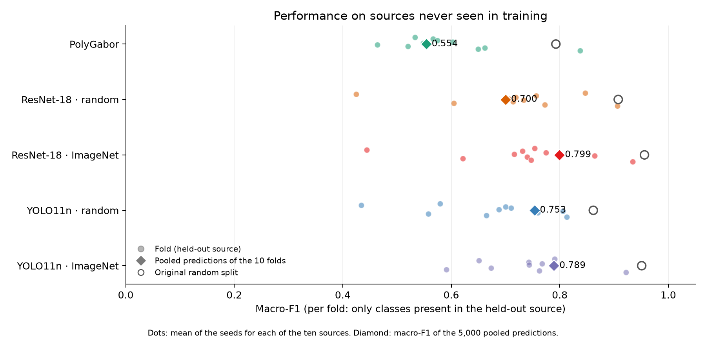
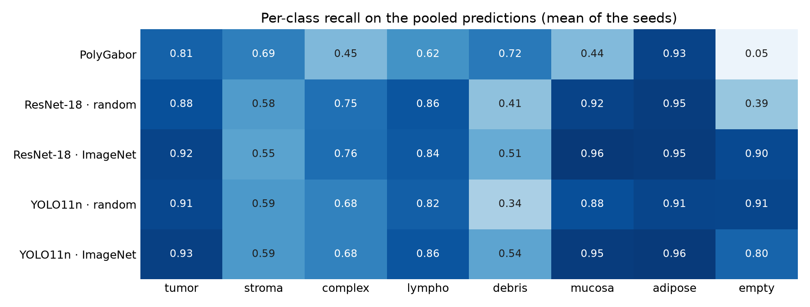

# Cross-source generalization (leave-one-source-out)

Campaign `2026-09-12`. File generated by `comparison/loso_report.py` from the saved predictions. 100 completed LOSO runs were found; 10 method/seed combinations have all ten folds. Each complete seed has 50 runs.

The 5,000 images belong to ten source codes, `CRC-Prim-HE-01` to `CRC-Prim-HE-10`, recovered through SHA-256 of the pixels in `source_manifest.json`. Each fold holds out one entire source for testing. Validation uses 10% of each class from the remaining nine sources, and training uses the rest. The indices were fixed in `loso_manifest.json` before any training and are identical for all methods and seeds. Hyperparameters, stopping criteria and the PolyGabor cap of 350 vectors/class are those of the main campaign.

Primary metric: macro-F1 over the 5,000 pooled predictions of the ten folds. Each crop is predicted exactly once, by a model that saw no crop from its source. Per-fold macro-F1 considers only the classes present in the held-out source, since most sources do not contain all eight classes.

## Folds

| fold | test_source | n_train | n_val | n_test | test_classes | train_empty |
| --- | --- | --- | --- | --- | --- | --- |
| loso_01 | 01 | 4141 | 458 | 401 | tumor, stroma, complex, lympho, debris, mucosa | 563 |
| loso_02 | 02 | 4245 | 471 | 284 | tumor, stroma, complex, lympho, debris, mucosa | 563 |
| loso_03 | 03 | 3835 | 425 | 740 | tumor, stroma, complex, lympho, debris, mucosa, adipose | 563 |
| loso_04 | 04 | 4159 | 460 | 381 | tumor, stroma, complex, lympho, debris, adipose | 563 |
| loso_05 | 05 | 3905 | 434 | 661 | tumor, stroma, complex, lympho, debris, mucosa, adipose | 563 |
| loso_06 | 06 | 3545 | 394 | 1061 | tumor, stroma, complex, lympho, debris, mucosa, adipose, empty | 31 |
| loso_07 | 07 | 4047 | 450 | 503 | tumor, stroma, complex, lympho, debris, mucosa, adipose | 563 |
| loso_08 | 08 | 4151 | 460 | 389 | tumor, stroma, complex, lympho, debris, mucosa | 563 |
| loso_09 | 09 | 4194 | 464 | 342 | tumor, stroma, complex, lympho, debris, mucosa | 563 |
| loso_10 | 10 | 4286 | 476 | 238 | tumor, stroma, complex, lympho, debris, adipose, empty | 531 |

The `empty` class exists only in sources 06 (590 crops) and 10 (35). When 06 is tested, training has only the `empty` examples from source 10, minus those held out for validation. For this reason the macro-F1 without the true `empty` crops is also reported.

## Pooled result

| method | seeds | macro_f1 | macro_f1_min | macro_f1_max | multiclass_gmean | balanced_accuracy | macro_f1_without_empty | random_split_macro_f1 | drop_vs_random_split |
| --- | --- | --- | --- | --- | --- | --- | --- | --- | --- |
| polygarbor | 2 | 0.5539 | 0.5480 | 0.5598 | 0.4691 | 0.5888 | 0.6638 | 0.7928 | 0.2389 |
| resnet18 | 2 | 0.7001 | 0.6475 | 0.7527 | 0.6337 | 0.7176 | 0.7640 | 0.9078 | 0.2077 |
| resnet18_imagenet | 2 | 0.7994 | 0.7988 | 0.8001 | 0.7796 | 0.7999 | 0.7875 | 0.9561 | 0.1566 |
| yolo11n_random | 2 | 0.7532 | 0.7462 | 0.7603 | 0.7223 | 0.7553 | 0.7330 | 0.8618 | 0.1086 |
| yolo11n | 2 | 0.7893 | 0.7880 | 0.7906 | 0.7721 | 0.7888 | 0.7894 | 0.9510 | 0.1617 |

`macro_f1_min`/`macro_f1_max` are the extremes across seeds, not a confidence interval. `random_split_macro_f1` is the clean test of the original random split with the same seeds; the drop estimates how much of the original performance depended on seeing crops from the same sources in training.

## Per-class recall

| method | tumor | stroma | complex | lympho | debris | mucosa | adipose | empty |
| --- | --- | --- | --- | --- | --- | --- | --- | --- |
| polygarbor | 0.8080 | 0.6936 | 0.4512 | 0.6192 | 0.7184 | 0.4432 | 0.9256 | 0.0512 |
| resnet18 | 0.8776 | 0.5808 | 0.7512 | 0.8560 | 0.4104 | 0.9240 | 0.9480 | 0.3928 |
| resnet18_imagenet | 0.9208 | 0.5504 | 0.7592 | 0.8400 | 0.5104 | 0.9640 | 0.9544 | 0.9000 |
| yolo11n_random | 0.9064 | 0.5928 | 0.6808 | 0.8168 | 0.3384 | 0.8824 | 0.9144 | 0.9104 |
| yolo11n | 0.9344 | 0.5912 | 0.6808 | 0.8568 | 0.5400 | 0.9496 | 0.9584 | 0.7992 |

## Macro-F1 per held-out source

| test_source | polygarbor | resnet18 | resnet18_imagenet | yolo11n_random | yolo11n |
| --- | --- | --- | --- | --- | --- |
| 01 | 0.5331 | 0.8468 | 0.7533 | 0.5794 | 0.7904 |
| 02 | 0.5663 | 0.4247 | 0.4442 | 0.4342 | 0.6509 |
| 03 | 0.5741 | 0.7563 | 0.7314 | 0.6998 | 0.7427 |
| 04 | 0.6021 | 0.7191 | 0.7743 | 0.7103 | 0.7674 |
| 05 | 0.5483 | 0.7061 | 0.7162 | 0.6882 | 0.7435 |
| 06 | 0.4639 | 0.7330 | 0.8642 | 0.8058 | 0.7876 |
| 07 | 0.5199 | 0.7135 | 0.7397 | 0.7596 | 0.6731 |
| 08 | 0.6621 | 0.6048 | 0.6215 | 0.5579 | 0.5909 |
| 09 | 0.6496 | 0.7728 | 0.7473 | 0.6646 | 0.7619 |
| 10 | 0.8375 | 0.9058 | 0.9342 | 0.8131 | 0.9218 |

## PolyGabor versus CNNs

| seed | a | b | macro_f1_b_minus_a | source_bootstrap_ci_low | source_bootstrap_ci_high | folds_a_better | folds_b_better |
| --- | --- | --- | --- | --- | --- | --- | --- |
| 42 | polygarbor | resnet18 | 0.1929 | 0.0044 | 0.2724 | 2 | 8 |
| 42 | polygarbor | resnet18_imagenet | 0.2403 | 0.0372 | 0.3186 | 2 | 8 |
| 42 | polygarbor | yolo11n_random | 0.1864 | -0.0054 | 0.2561 | 3 | 7 |
| 42 | polygarbor | yolo11n | 0.2308 | 0.0501 | 0.3056 | 1 | 9 |
| 43 | polygarbor | resnet18 | 0.0995 | 0.0387 | 0.1598 | 2 | 8 |
| 43 | polygarbor | resnet18_imagenet | 0.2508 | 0.0632 | 0.3229 | 2 | 8 |
| 43 | polygarbor | yolo11n_random | 0.2123 | 0.0115 | 0.2886 | 3 | 7 |
| 43 | polygarbor | yolo11n | 0.2400 | 0.0733 | 0.3021 | 1 | 9 |

Difference = pooled macro-F1 of B minus PolyGabor. The interval resamples the ten sources with replacement (5,000 draws), keeping all crops of each source together; with ten groups it is approximate. The fold columns count in how many sources each method had the higher macro-F1 on the present classes.

## Limits

The data come from ten images from a single institute and a single scanner. The metadata do not confirm the source codes as distinct patients. The result measures generalization across images of this collection, not external validation or proven patient-level separation. Validation comes from the same sources as training; the test remains source-disjoint.

These folds replace `source_a` and `source_b` as the source analysis. Those scenarios used two manually chosen partitions with one seed, validation without `adipose` and `empty`, and in `source_b` 42% of the test set was `empty`, with 35 examples of that class in training. They remain in the artifacts only as a historical record.
