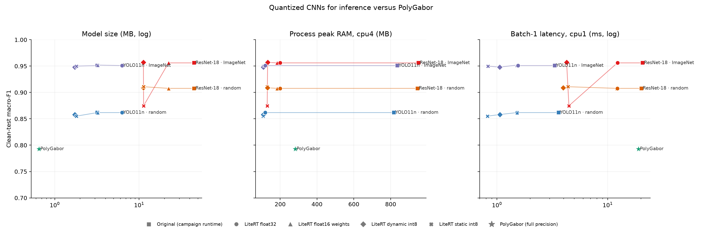

# Post-training quantization of the CNNs

Campaign `2026-09-12`. File generated by `comparison/quantization/report.py` from `metrics.csv`, `benchmark.csv` and the campaign results. The protocol is in `comparison/PROTOCOL.md`.

The full ResNet-18 and YOLO11n models, with random and ImageNet initialization and seeds 42 and 43, were converted to LiteRT without retraining. The Keras ResNet goes through SavedModel and the TensorFlow converter; YOLO is converted from PyTorch with litert-torch. Starting from float32, ai-edge-quantizer produces float16 weights, dynamic int8 and static int8, with float32 input and output. Static int8 calibration uses 200 training crops, 25 per class, seed 20260914. All variants run in the same ai-edge-litert interpreter with XNNPACK and with preprocessing that uses neither TensorFlow nor PyTorch. PolyGabor is included at full precision.

The LiteRT float32 row separates the effect of runtime and preprocessing from the effect of quantization; the run requires at least 99% agreement with the original predictions on the clean test.

## Performance

| method | variant | seeds | size_mb | macro_f1 | delta_macro_f1 | agreement_with_original | multiclass_gmean | perturbed_macro_f1 | perturbed_delta_macro_f1 | perturbed_agreement |
| --- | --- | --- | --- | --- | --- | --- | --- | --- | --- | --- |
| PolyGabor | Original (campaign runtime) | 2 | 0.6508 | 0.7928 | 0.0000 | 1.0000 | 0.7774 | 0.4570 | 0.0000 | 1.0000 |
| ResNet-18 · random | Original (campaign runtime) | 2 | 45.0087 | 0.9078 | 0.0000 | 1.0000 | 0.9006 | 0.7417 | 0.0000 | 1.0000 |
| ResNet-18 · random | LiteRT float32 | 2 | 44.7155 | 0.9078 | 0.0000 | 1.0000 | 0.9006 | 0.7421 | 0.0004 | 0.9995 |
| ResNet-18 · random | LiteRT float16 weights | 2 | 22.3758 | 0.9078 | 0.0000 | 1.0000 | 0.9006 | 0.7421 | 0.0004 | 0.9995 |
| ResNet-18 · random | LiteRT dynamic int8 | 2 | 11.2607 | 0.9088 | 0.0011 | 0.9980 | 0.9016 | 0.7412 | -0.0005 | 0.9950 |
| ResNet-18 · random | LiteRT static int8 | 2 | 11.3202 | 0.9109 | 0.0031 | 0.9940 | 0.9034 | 0.7412 | -0.0005 | 0.9830 |
| ResNet-18 · ImageNet | Original (campaign runtime) | 2 | 45.0117 | 0.9561 | 0.0000 | 1.0000 | 0.9556 | 0.7799 | 0.0000 | 1.0000 |
| ResNet-18 · ImageNet | LiteRT float32 | 2 | 44.7155 | 0.9561 | 0.0000 | 1.0000 | 0.9556 | 0.7802 | 0.0002 | 0.9988 |
| ResNet-18 · ImageNet | LiteRT float16 weights | 2 | 22.3758 | 0.9561 | 0.0000 | 1.0000 | 0.9556 | 0.7800 | 0.0001 | 0.9986 |
| ResNet-18 · ImageNet | LiteRT dynamic int8 | 2 | 11.2607 | 0.9572 | 0.0011 | 0.9920 | 0.9567 | 0.7808 | 0.0008 | 0.9925 |
| ResNet-18 · ImageNet | LiteRT static int8 | 2 | 11.3202 | 0.8748 | -0.0813 | 0.8830 | 0.8514 | 0.7365 | -0.0435 | 0.8500 |
| YOLO11n · random | Original (campaign runtime) | 2 | 3.2038 | 0.8618 | 0.0000 | 1.0000 | 0.8532 | 0.7998 | 0.0000 | 1.0000 |
| YOLO11n · random | LiteRT float32 | 2 | 6.2667 | 0.8618 | 0.0000 | 1.0000 | 0.8532 | 0.7998 | 0.0000 | 1.0000 |
| YOLO11n · random | LiteRT float16 weights | 2 | 3.2268 | 0.8618 | 0.0000 | 1.0000 | 0.8532 | 0.7998 | 0.0000 | 1.0000 |
| YOLO11n · random | LiteRT dynamic int8 | 2 | 1.7345 | 0.8581 | -0.0037 | 0.9960 | 0.8494 | 0.8002 | 0.0004 | 0.9942 |
| YOLO11n · random | LiteRT static int8 | 2 | 1.8051 | 0.8551 | -0.0067 | 0.9910 | 0.8462 | 0.7969 | -0.0029 | 0.9806 |
| YOLO11n · ImageNet | Original (campaign runtime) | 2 | 3.2038 | 0.9510 | 0.0000 | 1.0000 | 0.9504 | 0.8348 | 0.0000 | 1.0000 |
| YOLO11n · ImageNet | LiteRT float32 | 2 | 6.2667 | 0.9510 | 0.0000 | 1.0000 | 0.9504 | 0.8352 | 0.0004 | 0.9992 |
| YOLO11n · ImageNet | LiteRT float16 weights | 2 | 3.2268 | 0.9519 | 0.0009 | 0.9990 | 0.9513 | 0.8356 | 0.0008 | 0.9986 |
| YOLO11n · ImageNet | LiteRT dynamic int8 | 2 | 1.7345 | 0.9480 | -0.0030 | 0.9930 | 0.9473 | 0.8270 | -0.0079 | 0.9731 |
| YOLO11n · ImageNet | LiteRT static int8 | 2 | 1.8051 | 0.9500 | -0.0010 | 0.9900 | 0.9491 | 0.8208 | -0.0141 | 0.9616 |

Means over the available seeds. `delta_macro_f1` and `agreement_with_original` compare each variant with the original model of the same seed on the clean test. The `perturbed_*` columns average the campaign's eight fixed perturbations, with the same pixels.

## Size, latency and memory

| method | variant | mode | model_mb | median_ms | p95_ms | rss_peak_mb | invoke_median_ms | agreement_with_evaluation |
| --- | --- | --- | --- | --- | --- | --- | --- | --- |
| PolyGabor | Original (campaign runtime) | cpu1 | 0.6508 | 19.0296 | 25.6946 | 280.1377 | nan | nan |
| PolyGabor | Original (campaign runtime) | cpu4 | 0.6508 | 19.4757 | 21.0303 | 281.6164 | nan | nan |
| ResNet-18 · random | Original (campaign runtime) | cpu1 | 45.0087 | 20.1934 | 21.9657 | 939.3480 | nan | nan |
| ResNet-18 · random | Original (campaign runtime) | cpu4 | 45.0087 | 8.1954 | 13.7602 | 946.1105 | nan | nan |
| ResNet-18 · random | LiteRT float32 | cpu1 | 44.7155 | 12.2178 | 12.8157 | 199.7169 | 12.0752 | 1.0000 |
| ResNet-18 · random | LiteRT float32 | cpu4 | 44.7155 | 4.4565 | 5.3161 | 199.5366 | 4.2993 | 1.0000 |
| ResNet-18 · random | LiteRT float16 weights | cpu1 | 22.3758 | 12.1017 | 13.0863 | 182.8004 | 11.9684 | 1.0000 |
| ResNet-18 · random | LiteRT float16 weights | cpu4 | 22.3758 | 4.4706 | 5.2115 | 183.1731 | 4.3205 | 1.0000 |
| ResNet-18 · random | LiteRT dynamic int8 | cpu1 | 11.2607 | 3.9610 | 4.2858 | 131.9404 | 3.8755 | 1.0000 |
| ResNet-18 · random | LiteRT dynamic int8 | cpu4 | 11.2607 | 1.4703 | 1.6117 | 131.5308 | 1.3907 | 1.0000 |
| ResNet-18 · random | LiteRT static int8 | cpu1 | 11.3202 | 4.3871 | 5.1771 | 129.8678 | 4.2974 | 1.0000 |
| ResNet-18 · random | LiteRT static int8 | cpu4 | 11.3202 | 1.3968 | 1.8534 | 129.7531 | 1.3239 | 1.0000 |
| ResNet-18 · ImageNet | Original (campaign runtime) | cpu1 | 45.0117 | 20.7272 | 21.8705 | 945.8729 | nan | nan |
| ResNet-18 · ImageNet | Original (campaign runtime) | cpu4 | 45.0117 | 9.5494 | 13.0114 | 950.7676 | nan | nan |
| ResNet-18 · ImageNet | LiteRT float32 | cpu1 | 44.7155 | 12.3247 | 13.5255 | 199.5530 | 12.0696 | 1.0000 |
| ResNet-18 · ImageNet | LiteRT float32 | cpu4 | 44.7155 | 4.7901 | 5.8148 | 199.6800 | 4.4816 | 1.0000 |
| ResNet-18 · ImageNet | LiteRT float16 weights | cpu1 | 22.3758 | 12.2411 | 12.7958 | 183.1772 | 11.9774 | 1.0000 |
| ResNet-18 · ImageNet | LiteRT float16 weights | cpu4 | 22.3758 | 4.6898 | 5.3402 | 183.0953 | 4.3847 | 1.0000 |
| ResNet-18 · ImageNet | LiteRT dynamic int8 | cpu1 | 11.2607 | 4.2611 | 5.0065 | 132.2025 | 4.0683 | 1.0000 |
| ResNet-18 · ImageNet | LiteRT dynamic int8 | cpu4 | 11.2607 | 1.5130 | 2.1580 | 131.9158 | 1.2721 | 1.0000 |
| ResNet-18 · ImageNet | LiteRT static int8 | cpu1 | 11.3202 | 4.4691 | 4.8736 | 129.8268 | 4.2623 | 1.0000 |
| ResNet-18 · ImageNet | LiteRT static int8 | cpu4 | 11.3202 | 1.5205 | 1.9164 | 129.5401 | 1.3030 | 1.0000 |
| YOLO11n · random | Original (campaign runtime) | cpu1 | 3.2038 | 3.5999 | 3.9950 | 853.2869 | nan | nan |
| YOLO11n · random | Original (campaign runtime) | cpu4 | 3.2038 | 2.8881 | 3.6556 | 818.0040 | nan | nan |
| YOLO11n · random | LiteRT float32 | cpu1 | 6.2667 | 1.5179 | 1.6127 | 118.5260 | 1.3085 | 1.0000 |
| YOLO11n · random | LiteRT float32 | cpu4 | 6.2667 | 0.7910 | 1.1028 | 118.5096 | 0.5800 | 1.0000 |
| YOLO11n · random | LiteRT float16 weights | cpu1 | 3.2268 | 1.5189 | 1.6173 | 115.9905 | 1.3108 | 1.0000 |
| YOLO11n · random | LiteRT float16 weights | cpu4 | 3.2268 | 0.9024 | 1.0181 | 115.9905 | 0.6829 | 1.0000 |
| YOLO11n · random | LiteRT dynamic int8 | cpu1 | 1.7345 | 1.0624 | 1.0986 | 109.0929 | 0.8497 | 1.0000 |
| YOLO11n · random | LiteRT dynamic int8 | cpu4 | 1.7345 | 0.8994 | 1.1050 | 109.0273 | 0.6774 | 1.0000 |
| YOLO11n · random | LiteRT static int8 | cpu1 | 1.8051 | 0.8220 | 0.8635 | 108.9004 | 0.6157 | 1.0000 |
| YOLO11n · random | LiteRT static int8 | cpu4 | 1.8051 | 0.5962 | 0.7058 | 108.1057 | 0.3774 | 1.0000 |
| YOLO11n · ImageNet | Original (campaign runtime) | cpu1 | 3.2040 | 3.3195 | 3.7552 | 824.9958 | nan | nan |
| YOLO11n · ImageNet | Original (campaign runtime) | cpu4 | 3.2040 | 2.8806 | 3.1126 | 835.9977 | nan | nan |
| YOLO11n · ImageNet | LiteRT float32 | cpu1 | 6.2667 | 1.5471 | 1.7003 | 118.7922 | 1.3326 | 1.0000 |
| YOLO11n · ImageNet | LiteRT float32 | cpu4 | 6.2667 | 0.7907 | 0.9850 | 118.1491 | 0.5623 | 1.0000 |
| YOLO11n · ImageNet | LiteRT float16 weights | cpu1 | 3.2268 | 1.5158 | 1.7652 | 116.1462 | 1.3023 | 1.0000 |
| YOLO11n · ImageNet | LiteRT float16 weights | cpu4 | 3.2268 | 0.7747 | 1.0801 | 115.2737 | 0.5621 | 1.0000 |
| YOLO11n · ImageNet | LiteRT dynamic int8 | cpu1 | 1.7345 | 1.0575 | 1.1405 | 109.3100 | 0.8452 | 1.0000 |
| YOLO11n · ImageNet | LiteRT dynamic int8 | cpu4 | 1.7345 | 0.7916 | 0.9911 | 109.0273 | 0.5698 | 1.0000 |
| YOLO11n · ImageNet | LiteRT static int8 | cpu1 | 1.8051 | 0.8312 | 0.8701 | 108.8799 | 0.6213 | 1.0000 |
| YOLO11n · ImageNet | LiteRT static int8 | cpu4 | 1.8051 | 0.5937 | 0.6569 | 108.5522 | 0.3687 | 1.0000 |

Seed 42, 100 test images, a fresh process per model and mode, 10 warm-up predictions. `median_ms` includes preprocessing and execution; `invoke_median_ms` measures only the interpreter. Peak RAM is the RSS of the whole process, including Python and libraries. The original rows come from the campaign's edge benchmark, with TensorFlow, PyTorch or NumPy/OpenCV for PolyGabor, and do not isolate the runtime cost. In those rows peak RAM is sampled every 200 ms; in the LiteRT rows it is the maximum recorded by the kernel (`ru_maxrss`), which is never below the sampled value. `agreement_with_evaluation` checks the benchmark predictions against those of the evaluation.

## Limits

The measurements are on an x86 CPU with LiteRT; they do not represent TFLite Micro on a microcontroller, where activation memory, int8 kernels and firmware decide feasibility. Quantization is post-training, without fine-tuning. Sizes are those of the `.tflite` files, including graph metadata.
